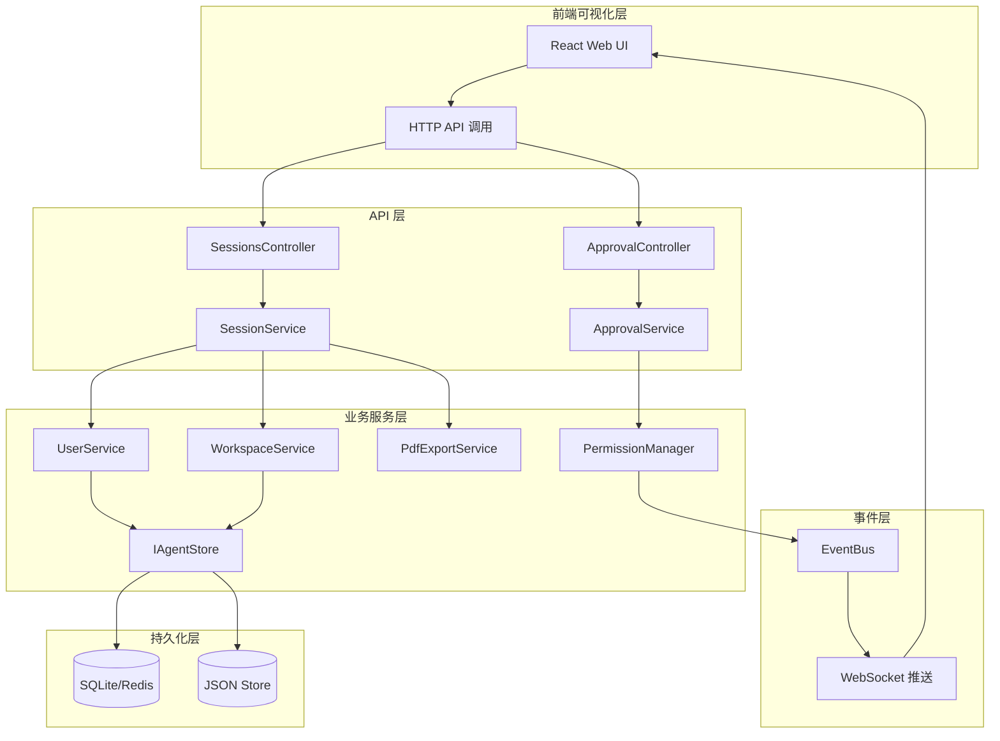
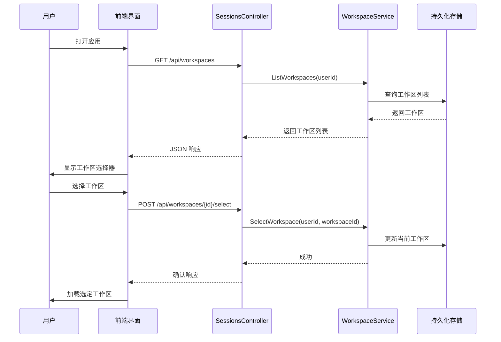
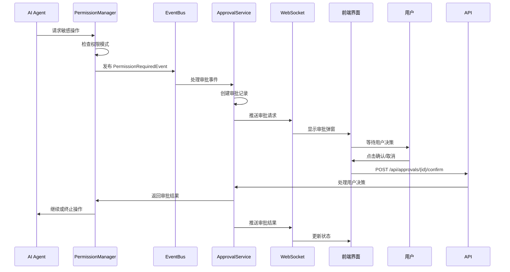

## 产品概述

完善 WebApiAssistant 工程的 SDK 接口功能,实现跨平台可视化界面,增强用户会话和工作区管理能力,提供完整的审批事件处理机制、接口文档和单元测试覆盖。

## 核心功能

- **用户服务增强**: 实现用户信息的持久化存储,从内存缓存升级到数据库持久化
- **会话工作区管理**: 实现用户会话工作区选择功能,支持多工作区隔离和管理
- **PDF 导出功能**: 完成会话和记忆的 PDF 导出实现,支持文档生成和下载
- **审批事件处理**: 为审批事项添加用户取消和确认的事件处理机制,支持实时审批流程
- **跨平台可视化界面**: 开发基于 React + TypeScript 的跨平台 Web 可视化界面
- **接口文档**: 集成 Swagger/OpenAPI 提供完整的 API 接口文档
- **单元测试覆盖**: 为核心服务和控制器编写完整的单元测试

## 技术栈

- **后端**: .NET 10 + ASP.NET Core Web API
- **前端可视化**: React 18 + TypeScript + Tailwind CSS + shadcn/ui
- **数据持久化**: SQLite (本地) / Redis (分布式,可选)
- **PDF 生成**: QuestPDF 或 iTextSharp
- **API 文档**: Swashbuckle.AspNetCore (Swagger/OpenAPI)
- **测试框架**: xUnit + Moq

## 技术架构

### 系统架构

基于现有的分层架构,扩展持久化层和前端可视化层:



### 模块划分

#### 1. 持久化服务模块

- **职责**: 用户、会话、工作区数据的持久化存储
- **技术**: SQLite + Entity Framework Core
- **依赖**: IAgentStore 扩展接口
- **接口**: IPersistenceService, IUserRepository, ISessionRepository

#### 2. 工作区管理模块

- **职责**: 用户工作区创建、选择、隔离管理
- **技术**: 内存缓存 + 持久化
- **依赖**: UserService, SessionService
- **接口**: IWorkspaceService

#### 3. 审批事件处理模块

- **职责**: 审批事项的用户取消和确认事件处理
- **技术**: EventBus + SignalR/WebSocket 实时推送
- **依赖**: PermissionManager, EventBus
- **接口**: IApprovalService, IApprovalEventHandler

#### 4. PDF 导出模块

- **职责**: 会话和记忆的 PDF 文档生成
- **技术**: QuestPDF
- **依赖**: SessionService, IAgentStore
- **接口**: IPdfExportService (已存在,需完善实现)

#### 5. 前端可视化模块

- **职责**: 跨平台 Web 可视化界面
- **技术**: React + TypeScript + Tailwind CSS + shadcn/ui
- **依赖**: Web API 后端服务
- **主要组件**: WorkspaceSelector, SessionList, ChatPanel, ApprovalModal

### 数据流

#### 用户工作区选择流程



#### 审批事件处理流程



## 实现细节

### 核心目录结构

#### 后端新增/修改文件

```
examples/Kode.Agent.WebApiAssistant/
├── Services/
│   ├── Persistence/
│   │   ├── Entities/
│   │   │   ├── UserEntity.cs          # 用户实体
│   │   │   ├── SessionEntity.cs       # 会话实体
│   │   │   └── WorkspaceEntity.cs     # 工作区实体
│   │   ├── IPersistenceService.cs     # 持久化服务接口
│   │   ├── SqlitePersistenceService.cs # SQLite 实现
│   │   └── AppDbContext.cs            # EF Core 上下文
│   ├── IWorkspaceService.cs           # 新增: 工作区服务接口
│   ├── WorkspaceService.cs            # 新增: 工作区服务实现
│   ├── IApprovalService.cs            # 新增: 审批服务接口
│   ├── ApprovalService.cs             # 新增: 审批服务实现
│   └── PdfExportService.cs             # 修改: 完善 PDF 导出实现
├── Controllers/
│   └── ApprovalController.cs          # 新增: 审批 API 控制器
├── Events/
│   ├── ApprovalEventHandler.cs        # 新增: 审批事件处理器
│   └── ApprovalRequestEvent.cs        # 新增: 审批请求事件
├── Hubs/
│   └── ApprovalHub.cs                 # 新增: 审批通知 SignalR Hub
└── tests/
    └── Services/
        ├── UserServiceTests.cs        # 新增: 用户服务测试
        ├── SessionServiceTests.cs     # 新增: 会话服务测试
        ├── WorkspaceServiceTests.cs   # 新增: 工作区服务测试
        └── ApprovalServiceTests.cs    # 新增: 审批服务测试
```

#### 前端可视化项目结构

```
examples/Kode.Agent.WebApiAssistant.WebUI/
├── src/
│   ├── components/
│   │   ├── layout/
│   │   │   ├── Header.tsx            # 顶部导航栏
│   │   │   ├── Sidebar.tsx           # 左侧会话列表
│   │   │   └── WorkspaceSelector.tsx # 工作区选择器
│   │   ├── chat/
│   │   │   ├── ChatPanel.tsx         # 聊天面板
│   │   │   ├── MessageList.tsx       # 消息列表
│   │   │   └── InputArea.tsx         # 输入区域
│   │   ├── approval/
│   │   │   ├── ApprovalModal.tsx     # 审批弹窗
│   │   │   └── ApprovalItem.tsx      # 审批项
│   │   └── workspace/
│   │       ├── WorkspaceList.tsx     # 工作区列表
│   │       └── WorkspaceCard.tsx     # 工作区卡片
│   ├── services/
│   │   ├── api.ts                    # API 客户端
│   │   ├── workspaceService.ts       # 工作区 API
│   │   ├── sessionService.ts         # 会话 API
│   │   └── approvalService.ts        # 审批 API
│   ├── hooks/
│   │   ├── useWorkspace.ts           # 工作区 Hook
│   │   ├── useSession.ts             # 会话 Hook
│   │   └── useApproval.ts            # 审批 Hook
│   ├── types/
│   │   ├── workspace.ts              # 工作区类型定义
│   │   ├── session.ts                # 会话类型定义
│   │   └── approval.ts               # 审批类型定义
│   ├── pages/
│   │   ├── HomePage.tsx              # 主页面
│   │   └── WorkspacePage.tsx         # 工作区页面
│   ├── App.tsx
│   └── main.tsx
├── package.json
├── vite.config.ts
└── tailwind.config.js
```

### 关键代码结构

#### 工作区实体定义

```
// 工作区实体
public class WorkspaceEntity
{
    public string WorkspaceId { get; set; }
    public string UserId { get; set; }
    public string Name { get; set; }
    public string Description { get; set; }
    public DateTime CreatedAt { get; set; }
    public DateTime UpdatedAt { get; set; }
    public bool IsActive { get; set; }
    public List<SessionEntity> Sessions { get; set; } = new();
}
```

#### 审批服务接口

```
public interface IApprovalService
{
    // 创建审批请求
    Task<string> CreateApprovalAsync(ApprovalRequest request);
    
    // 用户确认审批
    Task<bool> ConfirmApprovalAsync(string approvalId, string userId);
    
    // 用户取消审批
    Task<bool> CancelApprovalAsync(string approvalId, string userId);
    
    // 获取待审批列表
    Task<IReadOnlyList<Approval>> GetPendingApprovalsAsync(string userId);
}
```

#### 审批事件处理器

```
public class ApprovalEventHandler : IEventHandler<PermissionRequiredEvent>
{
    private readonly IApprovalService _approvalService;
    private readonly IHubContext<ApprovalHub> _hubContext;
    
    public async Task HandleAsync(PermissionRequiredEvent evt)
    {
        // 创建审批记录
        var approvalId = await _approvalService.CreateApprovalAsync(new ApprovalRequest
        {
            AgentId = evt.AgentId,
            ToolName = evt.ToolName,
            Arguments = evt.Arguments,
            UserId = evt.UserId
        });
        
        // 推送到前端
        await _hubContext.Clients.User(evt.UserId).SendAsync("ApprovalRequired", approvalId);
    }
}
```

#### PDF 导出服务完善

```
public class PdfExportService : IPdfExportService
{
    public async Task<byte[]> ExportSessionToPdfAsync(string sessionId, string userId)
    {
        var session = await _sessionService.GetSessionAsync(sessionId);
        var messages = await _store.GetMessagesAsync(sessionId);
        
        var document = Document.Create(container =>
        {
            container.Page(page =>
            {
                page.Margin(30);
                page.Header().Text($"会话: {session.Title}").FontSize(18).Bold();
                page.Content().Element(content =>
                {
                    content.Column(column =>
                    {
                        foreach (var msg in messages)
                        {
                            column.Item().Text($"{msg.Role}: {msg.Content}").Padding(5);
                        }
                    });
                });
            });
        });
        
        return document.GeneratePdf();
    }
}
```

### 技术实现计划

#### 1. 持久化存储实现

- **问题**: 当前仅使用内存缓存,数据丢失风险
- **方案**: 引入 SQLite + EF Core 实现数据持久化
- **关键技术**: Entity Framework Core, SQLite Provider
- **实现步骤**:

1. 定义实体类 (UserEntity, SessionEntity, WorkspaceEntity)
2. 创建 AppDbContext 和 DbSet
3. 实现 SqlitePersistenceService 接口
4. 配置数据库迁移和初始化
5. 更新 UserService 和 SessionService 使用持久化存储

#### 2. 工作区管理功能

- **问题**: 缺少工作区隔离和选择机制
- **方案**: 实现工作区服务,支持多工作区管理
- **关键技术**: Repository Pattern, 内存缓存 + 持久化
- **实现步骤**:

1. 定义 WorkspaceEntity 和 IWorkspaceService 接口
2. 实现 WorkspaceService (CRUD 操作)
3. 添加工作区 API 控制器
4. 实现工作区选择和切换逻辑
5. 会话数据按工作区隔离

#### 3. 审批事件处理机制

- **问题**: 审批功能缺少用户交互机制
- **方案**: 实现 ApprovalService + SignalR 实时推送
- **关键技术**: EventBus, SignalR, WebSocket
- **实现步骤**:

1. 定义 Approval 实体和事件
2. 实现 ApprovalService 和审批状态管理
3. 创建 ApprovalEventHandler 处理 PermissionRequiredEvent
4. 配置 SignalR Hub 推送审批通知
5. 创建 ApprovalController 提供审批 API

#### 4. PDF 导出功能完善

- **问题**: PDF 导出仅有 TODO 注释,未实现
- **方案**: 使用 QuestPDF 实现真正的 PDF 生成
- **关键技术**: QuestPDF, 流式处理
- **实现步骤**:

1. 安装 QuestPDF NuGet 包
2. 设计 PDF 模板和样式
3. 实现 ExportSessionToPdfAsync (会话导出)
4. 实现 ExportMemoryToPdfAsync (记忆导出)
5. 添加文件下载 API 端点

#### 5. 跨平台可视化界面

- **问题**: 缺少用户可视化界面
- **方案**: 开发 React + TypeScript 前端项目
- **关键技术**: React 18, TypeScript, Tailwind CSS, shadcn/ui, Vite
- **实现步骤**:

1. 初始化 React + Vite 项目
2. 配置 Tailwind CSS 和 shadcn/ui 组件
3. 创建布局组件 (Header, Sidebar, WorkspaceSelector)
4. 实现聊天面板 (ChatPanel, MessageList, InputArea)
5. 实现审批弹窗 (ApprovalModal)
6. 集成 API 服务层
7. 实现 SignalR 实时通信

#### 6. API 接口文档

- **问题**: 缺少完整的接口文档
- **方案**: 集成 Swashbuckle.AspNetCore 生成 Swagger 文档
- **关键技术**: Swagger/OpenAPI, XML 注释
- **实现步骤**:

1. 安装 Swashbuckle.AspNetCore
2. 配置 Swagger 生成选项
3. 为控制器和 API 添加 XML 注释
4. 配置认证和授权文档
5. 启用 Swagger UI 和 JSON 端点

#### 7. 单元测试覆盖

- **问题**: 缺少核心服务和控制器的测试
- **方案**: 使用 xUnit + Moq 编写单元测试
- **关键技术**: xUnit, Moq, FluentAssertions
- **实现步骤**:

1. 创建测试项目结构
2. 为 UserService 编写测试
3. 为 SessionService 编写测试
4. 为 WorkspaceService 编写测试
5. 为 ApprovalService 编写测试
6. 为 Controllers 编写集成测试

### 集成点

#### 后端服务集成

- **数据格式**: JSON (REST API), Protocol Buffers (可选)
- **第三方服务**: 
- SignalR (实时通信)
- SQLite (持久化存储)
- Redis (可选,分布式缓存)
- **认证授权**: API Key 认证 (现有), JWT (可选)

#### 前后端集成

- **通信协议**: HTTP/REST API, WebSocket (SignalR)
- **API 基础路径**: `/api/sessions`, `/api/workspaces`, `/api/approvals`
- **实时推送**: `/hubs/approval` (SignalR Hub)
- **认证方式**: API Key Header (`X-API-Key`)

## 技术考量

### 日志

- 遵循现有日志模式,使用 ILogger<T>
- 记录关键操作: 用户登录、工作区切换、审批决策
- 使用结构化日志,便于查询和分析

### 性能优化

- **缓存策略**: 内存缓存 + 持久化双层缓存
- **数据库优化**: 添加索引 (UserId, WorkspaceId, SessionId)
- **前端优化**: 代码分割、懒加载、虚拟滚动
- **API 优化**: 分页查询、ETag 缓存、压缩响应

### 安全措施

- **输入验证**: 所有 API 请求参数验证
- **认证授权**: API Key 认证,工作区隔离
- **数据加密**: 敏感数据加密存储
- **SQL 注入防护**: 使用参数化查询 (EF Core)
- **XSS 防护**: React 默认转义,额外内容消毒

### 可扩展性

- **存储层**: 支持 SQLite/Redis 多种存储后端
- **工作区**: 支持多用户、多工作区横向扩展
- **审批流程**: 支持多级审批、会签等扩展
- **前端组件**: 组件化设计,便于功能扩展

## 设计风格

采用现代 Glassmorphism 玻璃拟态风格,结合深色主题,营造科技感和专业感。

### 设计原则

1. **视觉层次**: 使用模糊、透明、阴影创建深度感
2. **交互反馈**: 平滑动画、悬停效果、微交互
3. **响应式设计**: 适配桌面端、平板、移动端
4. **无障碍性**: 高对比度、清晰导航、键盘支持

### 界面布局

#### 页面 1: 工作区选择页面 (WorkspaceSelectionPage)

- **功能**: 用户登录后选择或创建工作区
- **布局**: 居中卡片式布局,工作区网格展示
- **块设计**:

1. 顶部导航: Logo + 用户信息
2. 工作区列表: 网格布局,显示工作区卡片
3. 新建按钮: 浮动操作按钮 (FAB)
4. 底部信息: 版本号、帮助链接

#### 页面 2: 主聊天页面 (ChatPage)

- **功能**: 进行 AI 对话、管理会话
- **布局**: 左侧边栏 + 主内容区
- **块设计**:

1. 顶部导航: 工作区选择器 + 设置菜单
2. 左侧边栏: 会话列表 + 新建会话按钮
3. 聊天面板: 消息列表 + 输入区域
4. 审批弹窗: 模态框,显示待审批事项

#### 页面 3: 审批管理页面 (ApprovalPage)

- **功能**: 查看和管理所有审批事项
- **布局**: 列表视图 + 详情侧边栏
- **块设计**:

1. 顶部导航: 筛选器 + 搜索框
2. 审批列表: 表格展示,支持排序和过滤
3. 审批详情: 侧边栏滑出,显示详情和操作
4. 批量操作: 底部工具栏

#### 页面 4: 设置页面 (SettingsPage)

- **功能**: 配置用户偏好和系统设置
- **布局**: 分组设置 + 表单
- **块设计**:

1. 顶部导航: 面包屑导航
2. 设置分组: 个人设置、工作区设置、API 设置
3. 表单输入: 开关、下拉框、文本输入
4. 保存按钮: 固定底部操作栏

## Agent Extensions

### SubAgent

- **code-explorer**
- Purpose: 在整个代码库中搜索和分析现有代码模式,了解当前实现状态
- Expected outcome: 提供完整的代码结构分析,识别未实现的功能和需要修改的文件