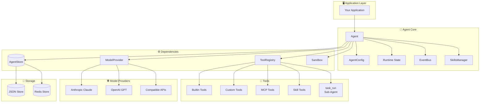
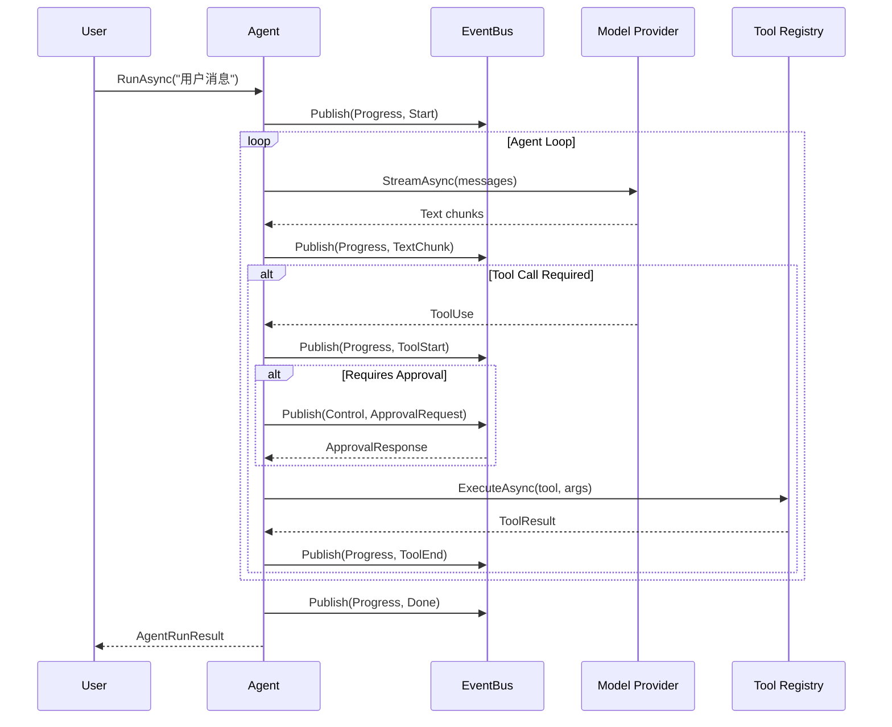
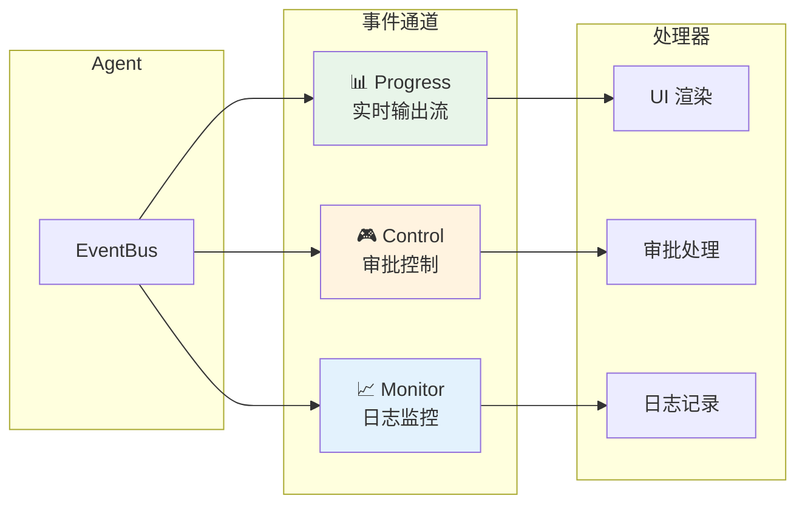

# Kode Agent SDK for .NET

> **English version**: [Read the English README](./README.md)

[](https://dotnet.microsoft.com/)
[](LICENSE)
[](https://www.nuget.org/)

一个强大的 AI Agent 运行时 SDK，基于 .NET 10 构建，支持 Anthropic Claude 和 OpenAI GPT 模型，提供完整的工具调用、状态管理、事件流等能力。专为构建生产级 AI 应用而设计。

## 🎯 项目背景

Kode Agent SDK for .NET 是 [Kode SDK](../README.md) 的 C# 实现，与 TypeScript 版本功能对等，提供：

- **事件驱动架构** - 三通道事件系统（Progress、Control、Monitor）分离关注点
- **完整状态管理** - 支持持久化、崩溃恢复、断点续传
- **灵活工具系统** - 内置 20+ 工具，支持自定义工具和 MCP 协议
- **多模型支持** - Anthropic Claude、OpenAI GPT 及兼容 API
- **企业级特性** - 权限控制、沙箱执行、依赖注入、日志集成

## 📑 目录

- [特性](#-特性)
- [架构概览](#-架构概览)
- [快速开始](#-快速开始)
- [事件订阅](#-事件订阅)
- [自定义工具](#-自定义工具)
- [模型提供者](#-模型提供者)
- [依赖注入](#-依赖注入)
- [MCP 集成](#-mcp-集成)
- [权限控制](#-权限控制)
- [内置工具](#-内置工具)
- [状态持久化](#-状态持久化)
- [项目结构](#-项目结构)
- [文档](#-文档)
- [运行示例](#-运行示例)
- [许可证](#-许可证)
- [贡献](#-贡献)
- [交流社区](#-交流社区)
- [相关链接](#-相关链接)

## ✨ 特性

| 特性                    | 描述                                                                                    | 文档                                                        |
| ----------------------- | --------------------------------------------------------------------------------------- | ----------------------------------------------------------- |
| 🤖 **多模型支持**       | 支持 Anthropic Claude (Claude 4, 3.5) 和 OpenAI GPT (GPT-4o, o1) 系列模型，以及兼容 API | [模型提供者](#模型提供者)                                   |
| 🔧 **丰富的工具系统**   | 20+ 内置工具（文件系统、Shell、Todo 管理等），支持自定义工具和 MCP 协议                 | [工具开发指南](docs/ADVANCED_GUIDE.md#工具开发指南)         |
| 📡 **三通道事件流**     | Progress（实时输出）、Control（审批流）、Monitor（日志监控）分离架构                    | [事件系统详解](docs/ADVANCED_GUIDE.md#事件系统详解)         |
| 💾 **状态持久化**       | JSON 文件存储和 Redis 分布式存储，支持会话恢复和断点续传                                | [状态存储](docs/ADVANCED_GUIDE.md#状态存储)                 |
| 🔒 **权限控制**         | 细粒度的工具权限管理，支持自动审批、手动审批和拒绝策略                                  | [权限控制系统](docs/ADVANCED_GUIDE.md#权限控制系统)         |
| 🛡️ **沙箱执行**         | 安全的命令执行环境，支持本地和 Docker 沙箱                                              | [进阶指南 - 沙箱](docs/ADVANCED_GUIDE.md)                   |
| ⚡ **Source Generator** | 编译时工具 Schema 生成，零反射开销，类型安全                                            | [工具开发指南](docs/ADVANCED_GUIDE.md#工具开发指南)         |
| 🔌 **MCP 集成**         | 原生支持 Model Context Protocol，轻松接入外部工具生态                                   | [MCP 协议集成](docs/ADVANCED_GUIDE.md#mcp-协议集成)         |
| 💉 **依赖注入**         | 完整的 Microsoft.Extensions.DependencyInjection 支持                                    | [依赖注入](#依赖注入)                                       |
| 📋 **模板系统**         | 预定义 Agent 模板，快速创建特定场景的 Agent                                             | [Sub-Agent 委派](docs/ADVANCED_GUIDE.md#sub-agent-任务委派) |
| 🎯 **Skills 系统**      | 渐进式技能发现与激活，动态扩展 Agent 能力                                               | [Skills 系统](docs/ADVANCED_GUIDE.md#skills-系统)           |
| 🔀 **Sub-Agent 委派**   | 支持任务委派给专门的子 Agent，实现复杂工作流编排                                        | [Sub-Agent 委派](docs/ADVANCED_GUIDE.md#sub-agent-任务委派) |

## 🏗️ 架构概览



### Agent 运行流程



## 📦 快速开始

### 1. 安装包

```bash
# 使用 NuGet (即将发布)
dotnet add package Kode.Agent.Sdk
dotnet add package Kode.Agent.Store.Json
dotnet add package Kode.Agent.Tools.Builtin

# 可选：MCP 支持
dotnet add package Kode.Agent.Mcp

# 可选：Redis 存储
dotnet add package Kode.Agent.Store.Redis
```

或者直接引用项目：

```xml
<ProjectReference Include="path/to/Kode.Agent.Sdk.csproj" />
<ProjectReference Include="path/to/Kode.Agent.Store.Json.csproj" />
<ProjectReference Include="path/to/Kode.Agent.Tools.Builtin.csproj" />
```

### 2. 配置环境变量

创建 `.env` 文件（推荐使用 Anthropic Claude）：

```dotenv
# Anthropic 配置（推荐）
ANTHROPIC_API_KEY=your-api-key-here
ANTHROPIC_MODEL_ID=claude-sonnet-4-20250514
ANTHROPIC_BASE_URL=https://api.anthropic.com  # 可选，支持自定义端点
```

可选配置其他提供者：

```dotenv
# OpenAI 配置 (可选)
OPENAI_API_KEY=your-api-key-here
OPENAI_MODEL_ID=gpt-5.2
OPENAI_BASE_URL=https://api.openai.com  # 可选，支持 Azure OpenAI

# 智谱 AI (可选)
DEFAULT_PROVIDER=anthropic
ANTHROPIC_API_KEY=your-api-key-here
ANTHROPIC_MODEL_ID=GLM-4.7
ANTHROPIC_BASE_URL=https://open.bigmodel.cn/api/anthropic
```

> 💡 **提示**: 也可以通过代码直接配置 API 密钥，无需 `.env` 文件。

### 3. 基本使用

```csharp
using Kode.Agent.Sdk.Core.Abstractions;
using Kode.Agent.Sdk.Core.Types;
using Kode.Agent.Sdk.Infrastructure.Providers;
using Kode.Agent.Sdk.Tools;
using Kode.Agent.Store.Json;
using Kode.Agent.Tools.Builtin;
using AgentImpl = Kode.Agent.Sdk.Core.Agent.Agent;

// 1. 创建存储
var store = new JsonAgentStore("./.kode");

// 2. 注册工具
var toolRegistry = new ToolRegistry();
toolRegistry.RegisterBuiltinTools();

// 3. 创建模型提供者（推荐使用 Anthropic Claude）
var provider = new AnthropicProvider(new AnthropicOptions
{
    ApiKey = Environment.GetEnvironmentVariable("ANTHROPIC_API_KEY")!,
    BaseUrl = Environment.GetEnvironmentVariable("ANTHROPIC_BASE_URL")
});

// 4. 创建依赖
var deps = new AgentDependencies
{
    Store = store,
    ToolRegistry = toolRegistry,
    ModelProvider = provider,
    SandboxFactory = new LocalSandboxFactory()
};

// 5. 配置 Agent
var config = new AgentConfig
{
    Model = "claude-sonnet-4-20250514",
    SystemPrompt = "You are a helpful assistant.",
    MaxIterations = 10,
    Tools = ["fs_read", "fs_glob", "fs_grep", "shell_exec"]
};

// 6. 创建并运行 Agent
var agent = await AgentImpl.CreateAsync("my-agent", config, deps);
await agent.RunAsync("帮我分析当前目录的项目结构");
```

## 📡 事件订阅

Agent 提供三个事件通道用于不同场景：



```csharp
// Progress 通道 - 实时输出流
await foreach (var envelope in agent.EventBus.SubscribeAsync(EventChannel.Progress))
{
    switch (envelope.Event)
    {
        case TextChunkEvent textChunk:
            Console.Write(textChunk.Delta);  // 流式输出文本
            break;

        case ToolStartEvent toolStart:
            Console.WriteLine($"[tool] {toolStart.Call.Name} starting...");
            break;

        case ToolEndEvent toolEnd:
            Console.WriteLine($"[tool] {toolEnd.Call.Name} completed");
            break;

        case DoneEvent:
            Console.WriteLine("Conversation complete");
            break;
    }
}

// Control 通道 - 需要人工干预的事件
await foreach (var envelope in agent.EventBus.SubscribeAsync(EventChannel.Control))
{
    if (envelope.Event is PermissionRequiredEvent approval)
    {
        // 处理需要审批的操作（示例：全部允许）
        await agent.ApproveToolCallAsync(approval.Call.Id);
    }
}

// Monitor 通道 - 日志和调试信息
await foreach (var envelope in agent.EventBus.SubscribeAsync(EventChannel.Monitor))
{
    if (envelope.Event is ErrorEvent err)
    {
        Console.WriteLine($"[{err.Severity}/{err.Phase}] {err.Message}");
    }
}
```

## 自定义工具

### 方式一：使用 Source Generator（推荐）

```csharp
using Kode.Agent.Sdk.Tools;

[Tool("weather")]
[Description("Get current weather for a location")]
public partial class WeatherTool : ITool
{
    [ToolParameter("location", required: true)]
    [Description("City name or coordinates")]
    public string Location { get; set; } = "";

    [ToolParameter("unit")]
    [Description("Temperature unit: celsius or fahrenheit")]
    public string Unit { get; set; } = "celsius";

    public async Task<ToolResult> ExecuteAsync(ToolContext context)
    {
        // 实现获取天气的逻辑
        var weather = await FetchWeather(Location, Unit);
        return ToolResult.Success(weather);
    }
}
```

### 方式二：手动注册

```csharp
toolRegistry.Register(new ToolDefinition
{
    Name = "calculator",
    Description = "Perform mathematical calculations",
    InputSchema = new
    {
        type = "object",
        properties = new
        {
            expression = new { type = "string", description = "Math expression to evaluate" }
        },
        required = new[] { "expression" }
    }
}, async (input, context) =>
{
    var expr = input["expression"]?.ToString();
    var result = EvaluateExpression(expr);
    return ToolResult.Success(result.ToString());
});
```

## 模型提供者

### Anthropic Claude

```csharp
var provider = new AnthropicProvider(new AnthropicOptions
{
    ApiKey = "your-api-key",
    BaseUrl = "https://api.anthropic.com",  // 或自定义端点
    ModelId = "claude-sonnet-4-20250514",
    EnableBetaFeatures = false
});
```

支持的模型：

- `claude-sonnet-4-20250514`
- `claude-3-5-sonnet-20241022`
- `claude-3-5-haiku-20241022`
- `claude-3-opus-20240229`

### OpenAI GPT

```csharp
var provider = new OpenAIProvider(new OpenAIOptions
{
    ApiKey = "your-api-key",
    BaseUrl = "https://api.openai.com",  // 或 Azure OpenAI 端点
    Organization = "your-org-id",  // 可选
    DefaultModel = "gpt-4o"
});
```

支持的模型：

- `gpt-4o`
- `gpt-4o-mini`
- `gpt-4-turbo`
- `o1-preview`
- `o1-mini`

### 使用 OpenAI 兼容端点

许多第三方服务提供 OpenAI 兼容 API：

```csharp
// 智谱 AI (BigModel)
var provider = new AnthropicProvider(new AnthropicOptions
{
    ApiKey = "your-key",
    BaseUrl = "https://open.bigmodel.cn/api/anthropic"
});

// DeepSeek
var provider = new OpenAIProvider(new OpenAIOptions
{
    ApiKey = "your-key",
    BaseUrl = "https://api.deepseek.com",
    DefaultModel = "deepseek-chat"
});
```

## 依赖注入

使用 Microsoft.Extensions.DependencyInjection：

```csharp
using Kode.Agent.Sdk.Extensions;

var services = new ServiceCollection();

// 注册 Agent SDK
services.AddKodeAgent(options =>
{
    options.DefaultModel = "claude-sonnet-4-20250514";
    options.StoreDirectory = "./.kode";
});

// 注册 Anthropic 提供者（推荐）
services.AddAnthropicProvider(options =>
{
    options.ApiKey = Configuration["Anthropic:ApiKey"]!;
    options.BaseUrl = Configuration["Anthropic:BaseUrl"];
});

// 或注册 OpenAI 提供者（可选）
// services.AddOpenAIProvider(options =>
// {
//     options.ApiKey = Configuration["OpenAI:ApiKey"]!;
// });

var serviceProvider = services.BuildServiceProvider();

// 使用
var agentFactory = serviceProvider.GetRequiredService<IAgentFactory>();
var agent = await agentFactory.CreateAsync("my-agent", config);
```

## 🔌 MCP 集成

SDK 原生支持 [Model Context Protocol (MCP)](https://modelcontextprotocol.io/)，可轻松接入外部工具生态：

```csharp
using Kode.Agent.Mcp;

// 配置 MCP 服务器
var mcpConfig = new McpConfig
{
    Servers = new Dictionary<string, McpServerConfig>
    {
        ["filesystem"] = new()
        {
            Command = "npx",
            Args = ["-y", "@modelcontextprotocol/server-filesystem", "/tmp"]
        },
        ["github"] = new()
        {
            Command = "npx",
            Args = ["-y", "@modelcontextprotocol/server-github"],
            Env = new() { ["GITHUB_TOKEN"] = Environment.GetEnvironmentVariable("GITHUB_TOKEN")! }
        }
    }
};

// 注册 MCP 工具
services.AddMcpTools(mcpConfig);
```

## 🔐 权限控制

SDK 提供灵活的权限控制机制：

```csharp
var config = new AgentConfig
{
    Model = "claude-sonnet-4-20250514",
    Tools = ["fs_read", "fs_write", "bash_run"],
    Permissions = new PermissionConfig
    {
        Mode = "auto",                       // auto | approval | readonly | custom
        RequireApprovalTools = ["bash_run"], // 强制需要审批的工具
        DenyTools = ["fs_rm"]                // 禁止使用的工具
    }
};
```

权限模式：

- `auto` - 默认允许（可配合 `RequireApprovalTools/DenyTools/AllowTools` 细化）
- `approval` - 所有工具都需要手动审批（返回 `permission_required`）
- `readonly` - 基于 `ToolDescriptor.metadata` 判断是否“会产生副作用”，会变更的工具直接 deny，其余 allow/ask（对齐 TS permission-modes）
- 自定义 mode - 需要在宿主进程注册对应的 permission mode handler

## 内置工具

SDK 提供了丰富的内置工具集：

### 文件系统工具

| 工具名          | 描述                       | 权限   |
| --------------- | -------------------------- | ------ |
| `fs_read`       | 读取文件内容，支持行号范围 | 只读   |
| `fs_write`      | 写入文件内容               | 需审批 |
| `fs_edit`       | 编辑文件（搜索替换）       | 需审批 |
| `fs_multi_edit` | 批量编辑多个文件           | 需审批 |
| `fs_glob`       | 文件模式搜索               | 只读   |
| `fs_grep`       | 文件内容搜索（正则）       | 只读   |
| `fs_list`       | 列出目录内容               | 只读   |
| `fs_rm`         | 删除文件或目录             | 需审批 |

### Shell 工具

| 工具名      | 描述             | 权限   |
| ----------- | ---------------- | ------ |
| `bash_run`  | 执行 Shell 命令  | 需审批 |
| `bash_logs` | 查看命令执行日志 | 只读   |
| `bash_kill` | 终止后台进程     | 需审批 |

### 任务管理工具

| 工具名       | 描述           | 权限   |
| ------------ | -------------- | ------ |
| `todo_read`  | 读取 Todo 列表 | 只读   |
| `todo_write` | 更新 Todo 列表 | 需审批 |
| `task_run`   | 运行预定义任务 | 需审批 |

### 技能工具

| 工具名           | 描述         | 权限   |
| ---------------- | ------------ | ------ |
| `skill_list`     | 列出可用技能 | 只读   |
| `skill_activate` | 激活技能     | 需审批 |
| `skill_resource` | 获取技能资源 | 只读   |

## 状态持久化

```csharp
// 运行中会持续持久化到 Store（messages/tool-calls/todos/meta/events）
await agent.RunAsync("开始任务");

// 保存一个“安全分叉点”快照（TS-aligned: agent.snapshot）
var snapshotId = await agent.SnapshotAsync();

// 从 Store 恢复（TS-aligned: resumeFromStore）
var restoredAgent = await Agent.ResumeFromStoreAsync("agent-id", deps);
await restoredAgent.RunAsync("继续我们之前的讨论");
```

## 📁 项目结构

```
csharp/
├── src/
│   ├── Kode.Agent.Sdk/              # 核心 SDK
│   │   ├── Core/                    # 核心抽象和类型
│   │   │   ├── Abstractions/        # IAgent, IEventBus, ITool 等接口
│   │   │   ├── Agent/               # Agent 实现
│   │   │   ├── Events/              # 事件系统
│   │   │   ├── Types/               # AgentConfig, Message 等类型
│   │   │   └── Todo/                # Todo 管理
│   │   ├── Infrastructure/          # 基础设施
│   │   │   ├── Providers/           # Anthropic/OpenAI 提供者
│   │   │   └── Sandbox/             # 沙箱执行
│   │   ├── Tools/                   # 工具系统（ToolRegistry, ToolBase）
│   │   └── Extensions/              # DI 扩展
│   ├── Kode.Agent.SourceGenerator/  # 编译时代码生成器
│   ├── Kode.Agent.Mcp/              # MCP 协议支持
│   ├── Kode.Agent.Store.Json/       # JSON 文件存储
│   ├── Kode.Agent.Store.Redis/      # Redis 分布式存储
│   └── Kode.Agent.Tools.Builtin/    # 内置工具实现
├── examples/
│   ├── Kode.Agent.Examples/         # 使用示例（Console）
│   └── Kode.Agent.WebApiAssistant/  # 使用示例（ASP.NET WebAPI，OpenAI SSE 兼容）
├── tests/
│   └── Kode.Agent.Tests/            # 单元和集成测试
└── docs/                            # 详细文档
    ├── ADVANCED_GUIDE.md            # 进阶指南
    └── API_REFERENCE.md             # API 参考
```

## ⚙️ 要求

- .NET 10.0 或更高版本
- 有效的 Anthropic 或 OpenAI API 密钥

## 📚 文档

### 核心文档

| 文档                                           | 描述                                                                                                                  |
| ---------------------------------------------- | --------------------------------------------------------------------------------------------------------------------- |
| **[进阶指南](docs/ADVANCED_GUIDE.md)**         | 深入讲解架构设计、事件系统、工具开发、Skills 系统、Sub-Agent 委派、MCP 集成、权限控制、状态管理等高级主题             |
| **[API 参考](docs/API_REFERENCE.md)**          | 完整的 API 文档，包含核心类型（AgentConfig、AgentDependencies）、Agent 生命周期、事件模型、MCP 集成类型、Store 接口等 |
| **[与 TypeScript 对齐](docs/TS_ALIGNMENT.md)** | C# SDK 与 TypeScript 实现的对齐状态、差异分析和持续对齐计划                                                           |

### 快速导航

#### 🏗️ 架构设计

- [整体架构概览](docs/ADVANCED_GUIDE.md#架构概览) - SDK 组件、依赖关系、核心组件说明
- [事件系统详解](docs/ADVANCED_GUIDE.md#事件系统详解) - 三通道架构、事件类型、订阅模式
- [Agent 生命周期](docs/ADVANCED_GUIDE.md#agent-生命周期) - 状态转换、断点状态、创建与恢复

#### 🔧 工具开发

- [工具开发指南](docs/ADVANCED_GUIDE.md#工具开发指南) - 工具接口、Source Generator、注册方式
- [MCP 协议集成](docs/ADVANCED_GUIDE.md#mcp-协议集成) - MCP 配置、常用服务器、工具过滤
- [内置工具列表](#内置工具) - 文件系统、Shell、任务管理、技能工具

#### 🎯 高级功能

- [Skills 系统](docs/ADVANCED_GUIDE.md#skills-系统) - 渐进式技能发现与激活
- [Sub-Agent 委派](docs/ADVANCED_GUIDE.md#sub-agent-任务委派) - 任务分解与模板管理
- [权限控制系统](docs/ADVANCED_GUIDE.md#权限控制系统) - 权限模式、配置示例、审批流程
- [状态存储](docs/ADVANCED_GUIDE.md#状态存储) - JSON/Redis 存储、断点续传

#### 📖 最佳实践

- [错误处理](docs/ADVANCED_GUIDE.md#错误处理) - 异常类型、处理模式
- [最佳实践](docs/ADVANCED_GUIDE.md#最佳实践) - Serilog 日志、超时设置、资源管理、会话管理

## 🚀 运行示例

### Console 示例

```bash
cd examples/Kode.Agent.Examples

# 复制环境变量模板
cp .env.example .env
# 编辑 .env 填入 API 密钥

# 运行示例
dotnet run
```

可用示例：

- **GettingStarted** - 基础用法，快速入门
- **AgentInbox** - 事件流和工具执行监控
- **ApprovalControl** - 人工审批流程控制
- **RoomCollab** - 多 Agent 协作场景
- **CustomToolsExample** - 自定义工具开发
- **HooksUsage** - 生命周期钩子使用
- **TemplateUsage** - Agent 模板系统
- **SchedulerUsage** - 定时任务调度
- **EventBusUsage** - 事件总线详解

### WebAPI 示例（OpenAI 兼容）

这是一个 ASP.NET WebAPI 应用，对外暴露 **OpenAI Chat Completions 兼容接口**，支持 SSE 流式输出。

**🎁 推荐优惠**：智谱 GLM Coding 超值订阅，支持 Claude Code、Cline 等 20+ 大编程工具！


[立即开拼，享限时惊喜价！](https://www.bigmodel.cn/glm-coding?ic=HFFPJWPZQN)

#### 快速启动

```bash
cd examples/Kode.Agent.WebApiAssistant

cp .env.example .env
# 编辑 .env 填入 API 密钥

dotnet run
```

默认监听地址以控制台输出为准（通常是 `http://localhost:5123`）。

#### 使用 OpenAI 客户端

由于接口完全兼容 OpenAI，您可以使用任何支持 OpenAI API 的客户端：

**配置地址**：`http://localhost:5123/v1/chat/completions`

**示例 - 使用 curl**：

```bash
# 非流式请求
curl http://localhost:5123/v1/chat/completions \
  -H "Content-Type: application/json" \
  -d '{
    "model": "claude-sonnet-4-20250514",
    "user": "my-session",
    "messages": [
      {"role": "system", "content": "You are a helpful assistant."},
      {"role": "user", "content": "你好，介绍一下你自己"}
    ],
    "stream": false
  }'

# 流式请求（SSE）
curl http://localhost:5123/v1/chat/completions \
  -H "Content-Type: application/json" \
  -H "Accept: text/event-stream" \
  -d '{
    "model": "claude-sonnet-4-20250514",
    "user": "my-session",
    "messages": [
      {"role": "user", "content": "用 3 句话总结一下今天的计划"}
    ],
    "stream": true
  }'
```

**支持的客户端**：
- [OpenAI Python SDK](https://github.com/openai/openai-python)
- [OpenAI Node.js SDK](https://github.com/openai/openai-node)
- [LangChain](https://js.langchain.com/)
- [LlamaIndex](https://www.llamaindex.ai/)
- [Cursor](https://cursor.sh/)
- [Continue](https://continue.dev/)
- [Cline](https://cline.so/)
- 任何其他支持自定义 OpenAI 端点的工具

**Python 示例**：

```python
from openai import OpenAI

client = OpenAI(
    base_url="http://localhost:5123/v1",
    api_key="anything"  # 不需要真实密钥
)

response = client.chat.completions.create(
    model="claude-sonnet-4-20250514",
    messages=[
        {"role": "system", "content": "You are a helpful assistant."},
        {"role": "user", "content": "帮我分析这个项目"}
    ],
    stream=True
)

for chunk in response:
    if chunk.choices[0].delta.content:
        print(chunk.choices[0].delta.content, end="")
```

**Node.js 示例**：

```javascript
import OpenAI from 'openai';

const openai = new OpenAI({
  baseURL: 'http://localhost:5123/v1',
  apiKey: 'anything'  // 不需要真实密钥
});

const stream = await openai.chat.completions.create({
  model: 'claude-sonnet-4-20250514',
  messages: [
    { role: 'system', content: 'You are a helpful assistant.' },
    { role: 'user', content: '帮我分析这个项目' }
  ],
  stream: true
});

for await (const chunk of stream) {
  process.stdout.write(chunk.choices[0]?.delta?.content || '');
}
```

#### 主要特性

| 特性 | 说明 |
|------|------|
| **OpenAI 兼容** | 完全兼容 OpenAI Chat Completions API |
| **SSE 流式输出** | 支持 `text/event-stream` 流式响应 |
| **会话持久化** | 自动保存对话状态，支持多轮对话 |
| **工具调用** | 支持文件系统、Shell、Email、通知等工具 |
| **权限控制** | 细粒度的工具权限管理 |
| **MCP 集成** | 支持 Model Context Protocol 外部工具 |

更详细的接口说明见 `examples/Kode.Agent.WebApiAssistant/README.md`。

## 📄 许可证

MIT License

## 🤝 贡献

欢迎提交 Issue 和 Pull Request！请查阅 [贡献指南](CONTRIBUTING.md) 了解更多信息。

## 💬 交流社区

加入我们的微信交流群，一起讨论技术问题和最佳实践：


## 🔗 相关链接

| 链接                                                         | 描述                            |
| ------------------------------------------------------------ | ------------------------------- |
| [Kode SDK (TypeScript)](https://github.com/shareAI-lab/kode-agent-sdk) | TypeScript 版本的 SDK，功能对等 |
| [示例项目](examples/)                                        | Console 和 WebAPI 示例          |
| [源代码](src/)                                               | 核心 SDK 实现代码               |
| [测试代码](tests/)                                           | 单元和集成测试                  |
| [变更日志](CHANGELOG.md)                                     | 版本更新记录                    |

### 生态系统

- **[内置工具](src/Kode.Agent.Tools.Builtin/)** - 文件系统、Shell、Todo 等工具实现
- **[MCP 集成](src/Kode.Agent.Mcp/)** - Model Context Protocol 支持
- **[存储后端](src/Kode.Agent.Store.Json/)** - JSON 和 Redis 存储
