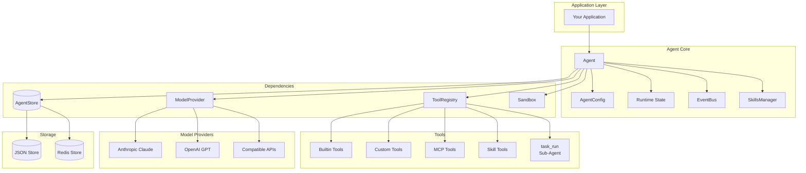
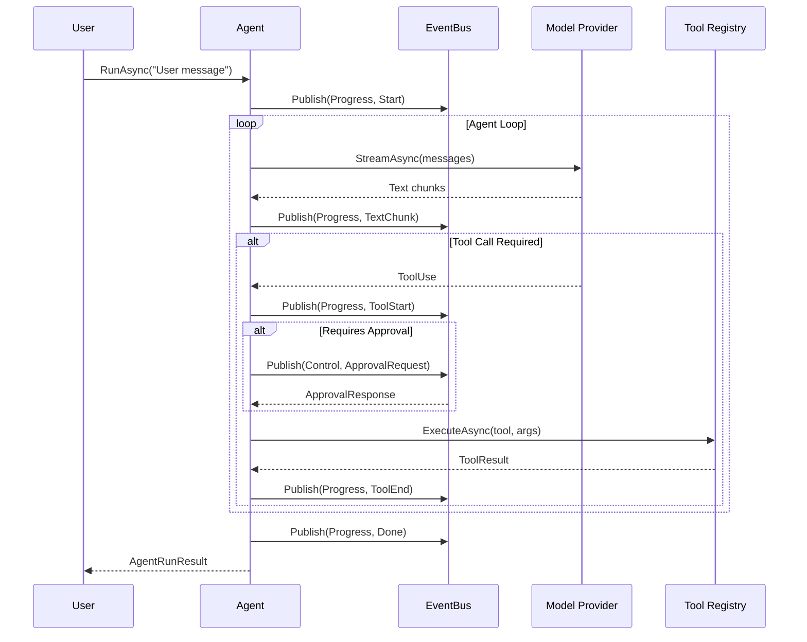
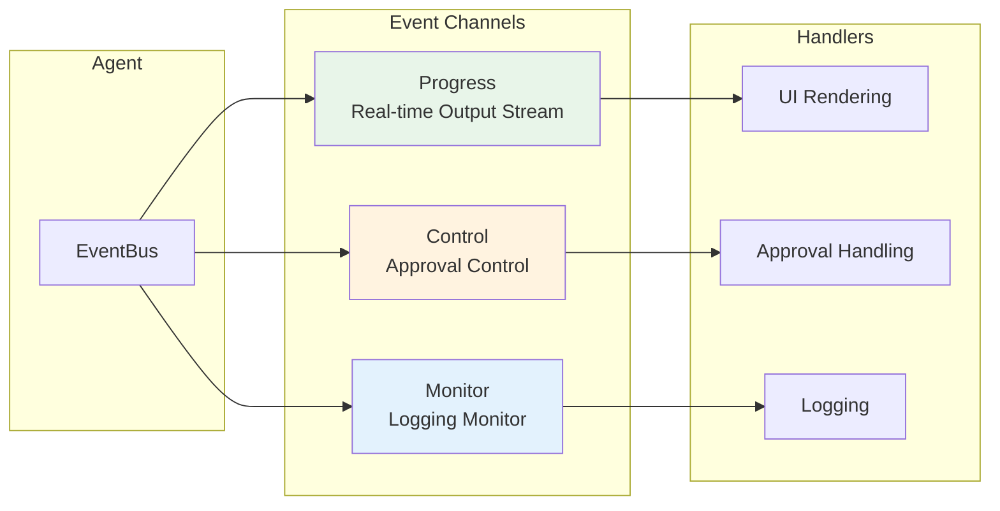

# Kode Agent SDK for .NET

> **中文版**: [查看中文 README](./README-zh.md)

[](https://dotnet.microsoft.com/)
[](LICENSE)
[](https://www.nuget.org/)

A powerful AI Agent runtime SDK built on .NET 10, supporting Anthropic Claude and OpenAI GPT models, with comprehensive capabilities for tool calling, state management, event streaming, and more. Designed for building production-grade AI applications.

## Project Background

Kode Agent SDK for .NET is the C# implementation of [Kode SDK](../README.md), providing feature parity with the TypeScript version:

- **Event-Driven Architecture** - Three-channel event system (Progress, Control, Monitor) for separation of concerns
- **Complete State Management** - Support for persistence, crash recovery, and resumable execution
- **Flexible Tool System** - 20+ built-in tools with support for custom tools and MCP protocol
- **Multi-Model Support** - Anthropic Claude, OpenAI GPT, and compatible APIs
- **Enterprise Features** - Permission control, sandbox execution, dependency injection, logging integration

## Table of Contents

- [Features](#-features)
- [Architecture Overview](#-architecture-overview)
- [Quick Start](#-quick-start)
- [Event Subscriptions](#-event-subscriptions)
- [Custom Tools](#-custom-tools)
- [Model Providers](#-model-providers)
- [Dependency Injection](#-dependency-injection)
- [MCP Integration](#-mcp-integration)
- [Permission Control](#-permission-control)
- [Built-in Tools](#-built-in-tools)
- [State Persistence](#-state-persistence)
- [Project Structure](#-project-structure)
- [Documentation](#-documentation)
- [Running Examples](#-running-examples)
- [License](#-license)
- [Contributing](#-contributing)
- [Community](#-community)
- [Related Links](#-related-links)

## Features

| Feature                    | Description                                                                                    | Documentation                                                        |
| ----------------------- | --------------------------------------------------------------------------------------- | ----------------------------------------------------------- |
| Multi-Model Support       | Support for Anthropic Claude (Claude 4, 3.5) and OpenAI GPT (GPT-4o, o1) series models, plus compatible APIs | [Model Providers](#model-providers)                                   |
| Rich Tool System   | 20+ built-in tools (file system, shell, todo management, etc.), support for custom tools and MCP protocol                 | [Tool Development Guide](docs/ADVANCED_GUIDE.md#tool-development-guide)         |
| Three-Channel Event Stream     | Progress (real-time output), Control (approval flow), Monitor (logging) separated architecture                    | [Event System Details](docs/ADVANCED_GUIDE.md#event-system-details)         |
| State Persistence       | JSON file storage and Redis distributed storage, support for session recovery and resumable execution                                | [State Storage](docs/ADVANCED_GUIDE.md#state-storage)                 |
| Permission Control         | Fine-grained tool permission management, support for auto-approval, manual approval, and deny policies                                  | [Permission Control System](docs/ADVANCED_GUIDE.md#permission-control-system)         |
| Sandbox Execution         | Secure command execution environment, support for local and Docker sandboxes                                              | [Advanced Guide - Sandbox](docs/ADVANCED_GUIDE.md)                   |
| Source Generator | Compile-time tool schema generation, zero reflection overhead, type-safe                                            | [Tool Development Guide](docs/ADVANCED_GUIDE.md#tool-development-guide)         |
| MCP Integration         | Native Model Context Protocol support, easy integration with external tool ecosystem                                   | [MCP Protocol Integration](docs/ADVANCED_GUIDE.md#mcp-protocol-integration)         |
| Dependency Injection         | Complete Microsoft.Extensions.DependencyInjection support                                    | [Dependency Injection](#dependency-injection)                                       |
| Template System         | Predefined agent templates for quick creation of scenario-specific agents                                             | [Sub-Agent Delegation](docs/ADVANCED_GUIDE.md#sub-agent-delegation) |
| Skills System      | Progressive skill discovery and activation, dynamic extension of agent capabilities                                               | [Skills System](docs/ADVANCED_GUIDE.md#skills-system)           |
| Sub-Agent Delegation   | Support for task delegation to specialized sub-agents, enabling complex workflow orchestration                                        | [Sub-Agent Delegation](docs/ADVANCED_GUIDE.md#sub-agent-delegation) |

## Architecture Overview



### Agent Execution Flow



## Quick Start

### 1. Install Packages

```bash
# Using NuGet (coming soon)
dotnet add package Kode.Agent.Sdk
dotnet add package Kode.Agent.Store.Json
dotnet add package Kode.Agent.Tools.Builtin

# Optional: MCP support
dotnet add package Kode.Agent.Mcp

# Optional: Redis storage
dotnet add package Kode.Agent.Store.Redis
```

Or reference projects directly:

```xml
<ProjectReference Include="path/to/Kode.Agent.Sdk.csproj" />
<ProjectReference Include="path/to/Kode.Agent.Store.Json.csproj" />
<ProjectReference Include="path/to/Kode.Agent.Tools.Builtin.csproj" />
```

### 2. Configure Environment Variables

Create a `.env` file (Anthropic Claude recommended):

```dotenv
# Anthropic configuration (recommended)
ANTHROPIC_API_KEY=your-api-key-here
ANTHROPIC_MODEL_ID=claude-sonnet-4-20250514
ANTHROPIC_BASE_URL=https://api.anthropic.com  # Optional, supports custom endpoint
```

Optional configuration for other providers:

```dotenv
# OpenAI configuration (optional)
OPENAI_API_KEY=your-api-key-here
OPENAI_MODEL_ID=gpt-5.2
OPENAI_BASE_URL=https://api.openai.com  # Optional, supports Azure OpenAI

# Zhipu AI (optional)
DEFAULT_PROVIDER=anthropic
ANTHROPIC_API_KEY=your-api-key-here
ANTHROPIC_MODEL_ID=GLM-4.7
ANTHROPIC_BASE_URL=https://open.bigmodel.cn/api/anthropic
```

> **Tip**: You can also configure API keys directly in code without a `.env` file.

### 3. Basic Usage

```csharp
using Kode.Agent.Sdk.Core.Abstractions;
using Kode.Agent.Sdk.Core.Types;
using Kode.Agent.Sdk.Infrastructure.Providers;
using Kode.Agent.Sdk.Tools;
using Kode.Agent.Store.Json;
using Kode.Agent.Tools.Builtin;
using AgentImpl = Kode.Agent.Sdk.Core.Agent.Agent;

// 1. Create storage
var store = new JsonAgentStore("./.kode");

// 2. Register tools
var toolRegistry = new ToolRegistry();
toolRegistry.RegisterBuiltinTools();

// 3. Create model provider (Anthropic Claude recommended)
var provider = new AnthropicProvider(new AnthropicOptions
{
    ApiKey = Environment.GetEnvironmentVariable("ANTHROPIC_API_KEY")!,
    BaseUrl = Environment.GetEnvironmentVariable("ANTHROPIC_BASE_URL")
});

// 4. Create dependencies
var deps = new AgentDependencies
{
    Store = store,
    ToolRegistry = toolRegistry,
    ModelProvider = provider,
    SandboxFactory = new LocalSandboxFactory()
};

// 5. Configure agent
var config = new AgentConfig
{
    Model = "claude-sonnet-4-20250514",
    SystemPrompt = "You are a helpful assistant.",
    MaxIterations = 10,
    Tools = ["fs_read", "fs_glob", "fs_grep", "shell_exec"]
};

// 6. Create and run agent
var agent = await AgentImpl.CreateAsync("my-agent", config, deps);
await agent.RunAsync("Help me analyze the project structure of the current directory");
```

## Event Subscriptions

Agent provides three event channels for different scenarios:



```csharp
// Progress channel - Real-time output stream
await foreach (var envelope in agent.EventBus.SubscribeAsync(EventChannel.Progress))
{
    switch (envelope.Event)
    {
        case TextChunkEvent textChunk:
            Console.Write(textChunk.Delta);  // Stream text output
            break;

        case ToolStartEvent toolStart:
            Console.WriteLine($"[tool] {toolStart.Call.Name} starting...");
            break;

        case ToolEndEvent toolEnd:
            Console.WriteLine($"[tool] {toolEnd.Call.Name} completed");
            break;

        case DoneEvent:
            Console.WriteLine("Conversation complete");
            break;
    }
}

// Control channel - Events requiring human intervention
await foreach (var envelope in agent.EventBus.SubscribeAsync(EventChannel.Control))
{
    if (envelope.Event is PermissionRequiredEvent approval)
    {
        // Handle operations requiring approval (example: allow all)
        await agent.ApproveToolCallAsync(approval.Call.Id);
    }
}

// Monitor channel - Logging and debugging information
await foreach (var envelope in agent.EventBus.SubscribeAsync(EventChannel.Monitor))
{
    if (envelope.Event is ErrorEvent err)
    {
        Console.WriteLine($"[{err.Severity}/{err.Phase}] {err.Message}");
    }
}
```

## Custom Tools

### Method 1: Using Source Generator (Recommended)

```csharp
using Kode.Agent.Sdk.Tools;

[Tool("weather")]
[Description("Get current weather for a location")]
public partial class WeatherTool : ITool
{
    [ToolParameter("location", required: true)]
    [Description("City name or coordinates")]
    public string Location { get; set; } = "";

    [ToolParameter("unit")]
    [Description("Temperature unit: celsius or fahrenheit")]
    public string Unit { get; set; } = "celsius";

    public async Task<ToolResult> ExecuteAsync(ToolContext context)
    {
        // Implement weather fetching logic
        var weather = await FetchWeather(Location, Unit);
        return ToolResult.Success(weather);
    }
}
```

### Method 2: Manual Registration

```csharp
toolRegistry.Register(new ToolDefinition
{
    Name = "calculator",
    Description = "Perform mathematical calculations",
    InputSchema = new
    {
        type = "object",
        properties = new
        {
            expression = new { type = "string", description = "Math expression to evaluate" }
        },
        required = new[] { "expression" }
    }
}, async (input, context) =>
{
    var expr = input["expression"]?.ToString();
    var result = EvaluateExpression(expr);
    return ToolResult.Success(result.ToString());
});
```

## Model Providers

### Anthropic Claude

```csharp
var provider = new AnthropicProvider(new AnthropicOptions
{
    ApiKey = "your-api-key",
    BaseUrl = "https://api.anthropic.com",  // Or custom endpoint
    ModelId = "claude-sonnet-4-20250514",
    EnableBetaFeatures = false
});
```

Supported models:

- `claude-sonnet-4-20250514`
- `claude-3-5-sonnet-20241022`
- `claude-3-5-haiku-20241022`
- `claude-3-opus-20240229`

### OpenAI GPT

```csharp
var provider = new OpenAIProvider(new OpenAIOptions
{
    ApiKey = "your-api-key",
    BaseUrl = "https://api.openai.com",  // Or Azure OpenAI endpoint
    Organization = "your-org-id",  // Optional
    DefaultModel = "gpt-4o"
});
```

Supported models:

- `gpt-4o`
- `gpt-4o-mini`
- `gpt-4-turbo`
- `o1-preview`
- `o1-mini`

### Using OpenAI Compatible Endpoints

Many third-party services provide OpenAI-compatible APIs:

```csharp
// Zhipu AI (BigModel)
var provider = new AnthropicProvider(new AnthropicOptions
{
    ApiKey = "your-key",
    BaseUrl = "https://open.bigmodel.cn/api/anthropic"
});

// DeepSeek
var provider = new OpenAIProvider(new OpenAIOptions
{
    ApiKey = "your-key",
    BaseUrl = "https://api.deepseek.com",
    DefaultModel = "deepseek-chat"
});
```

## Dependency Injection

Using Microsoft.Extensions.DependencyInjection:

```csharp
using Kode.Agent.Sdk.Extensions;

var services = new ServiceCollection();

// Register Agent SDK
services.AddKodeAgent(options =>
{
    options.DefaultModel = "claude-sonnet-4-20250514";
    options.StoreDirectory = "./.kode";
});

// Register Anthropic provider (recommended)
services.AddAnthropicProvider(options =>
{
    options.ApiKey = Configuration["Anthropic:ApiKey"]!;
    options.BaseUrl = Configuration["Anthropic:BaseUrl"];
});

// Or register OpenAI provider (optional)
// services.AddOpenAIProvider(options =>
// {
//     options.ApiKey = Configuration["OpenAI:ApiKey"]!;
// });

var serviceProvider = services.BuildServiceProvider();

// Use
var agentFactory = serviceProvider.GetRequiredService<IAgentFactory>();
var agent = await agentFactory.CreateAsync("my-agent", config);
```

## MCP Integration

SDK has native support for [Model Context Protocol (MCP)](https://modelcontextprotocol.io/), making it easy to integrate external tool ecosystems:

```csharp
using Kode.Agent.Mcp;

// Configure MCP servers
var mcpConfig = new McpConfig
{
    Servers = new Dictionary<string, McpServerConfig>
    {
        ["filesystem"] = new()
        {
            Command = "npx",
            Args = ["-y", "@modelcontextprotocol/server-filesystem", "/tmp"]
        },
        ["github"] = new()
        {
            Command = "npx",
            Args = ["-y", "@modelcontextprotocol/server-github"],
            Env = new() { ["GITHUB_TOKEN"] = Environment.GetEnvironmentVariable("GITHUB_TOKEN")! }
        }
    }
};

// Register MCP tools
services.AddMcpTools(mcpConfig);
```

## Permission Control

SDK provides a flexible permission control mechanism:

```csharp
var config = new AgentConfig
{
    Model = "claude-sonnet-4-20250514",
    Tools = ["fs_read", "fs_write", "bash_run"],
    Permissions = new PermissionConfig
    {
        Mode = "auto",                       // auto | approval | readonly | custom
        RequireApprovalTools = ["bash_run"], // Tools requiring approval
        DenyTools = ["fs_rm"]                // Forbidden tools
    }
};
```

Permission modes:

- `auto` - Default allow (can be refined with `RequireApprovalTools/DenyTools/AllowTools`)
- `approval` - All tools require manual approval (returns `permission_required`)
- `readonly` - Based on `ToolDescriptor.metadata` to determine if it "has side effects", tools that mutate state are directly denied, others allow/ask (aligned with TS permission-modes)
- Custom mode - Requires registering corresponding permission mode handler in host process

## Built-in Tools

SDK provides a rich set of built-in tools:

### File System Tools

| Tool Name          | Description                       | Permission   |
| --------------- | -------------------------- | ------ |
| `fs_read`       | Read file content, supports line ranges | Read-only   |
| `fs_write`      | Write file content               | Requires approval |
| `fs_edit`       | Edit file (search and replace)       | Requires approval |
| `fs_multi_edit` | Batch edit multiple files           | Requires approval |
| `fs_glob`       | File pattern search               | Read-only   |
| `fs_grep`       | File content search (regex)       | Read-only   |
| `fs_list`       | List directory contents               | Read-only   |
| `fs_rm`         | Delete file or directory             | Requires approval |

### Shell Tools

| Tool Name      | Description             | Permission   |
| ----------- | ---------------- | ------ |
| `bash_run`  | Execute Shell commands  | Requires approval |
| `bash_logs` | View command execution logs | Read-only   |
| `bash_kill` | Terminate background process     | Requires approval |

### Task Management Tools

| Tool Name       | Description           | Permission   |
| ------------ | -------------- | ------ |
| `todo_read`  | Read Todo list | Read-only   |
| `todo_write` | Update Todo list | Requires approval |
| `task_run`   | Run predefined tasks | Requires approval |

### Skills Tools

| Tool Name           | Description         | Permission   |
| ---------------- | ------------ | ------ |
| `skill_list`     | List available skills | Read-only   |
| `skill_activate` | Activate skill     | Requires approval |
| `skill_resource` | Get skill resources | Read-only   |

## State Persistence

```csharp
// Continuously persists to Store during execution (messages/tool-calls/todos/meta/events)
await agent.RunAsync("Start task");

// Save a "safe fork point" snapshot (TS-aligned: agent.snapshot)
var snapshotId = await agent.SnapshotAsync();

// Resume from Store (TS-aligned: resumeFromStore)
var restoredAgent = await Agent.ResumeFromStoreAsync("agent-id", deps);
await restoredAgent.RunAsync("Continue our previous discussion");
```

## Project Structure

```
csharp/
├── src/
│   ├── Kode.Agent.Sdk/              # Core SDK
│   │   ├── Core/                    # Core abstractions and types
│   │   │   ├── Abstractions/        # IAgent, IEventBus, ITool etc.
│   │   │   ├── Agent/               # Agent implementation
│   │   │   ├── Events/              # Event system
│   │   │   ├── Types/               # AgentConfig, Message etc.
│   │   │   └── Todo/                # Todo management
│   │   ├── Infrastructure/          # Infrastructure
│   │   │   ├── Providers/           # Anthropic/OpenAI providers
│   │   │   └── Sandbox/             # Sandbox execution
│   │   ├── Tools/                   # Tool system (ToolRegistry, ToolBase)
│   │   └── Extensions/              # DI extensions
│   ├── Kode.Agent.SourceGenerator/  # Compile-time code generator
│   ├── Kode.Agent.Mcp/              # MCP protocol support
│   ├── Kode.Agent.Store.Json/       # JSON file storage
│   ├── Kode.Agent.Store.Redis/      # Redis distributed storage
│   └── Kode.Agent.Tools.Builtin/    # Built-in tool implementations
├── examples/
│   ├── Kode.Agent.Examples/         # Usage examples (Console)
│   └── Kode.Agent.WebApiAssistant/  # Usage examples (ASP.NET WebAPI, OpenAI SSE compatible)
├── tests/
│   └── Kode.Agent.Tests/            # Unit and integration tests
└── docs/                            # Detailed documentation
    ├── ADVANCED_GUIDE.md            # Advanced guide
    └── API_REFERENCE.md             # API reference
```

## Requirements

- .NET 10.0 or higher
- Valid Anthropic or OpenAI API key

## Documentation

### Core Documentation

| Document                                           | Description                                                                                                                  |
| ---------------------------------------------- | --------------------------------------------------------------------------------------------------------------------- |
| **[Advanced Guide](docs/ADVANCED_GUIDE.md)**         | Deep dive into architecture design, event system, tool development, Skills system, Sub-Agent delegation, MCP integration, permission control, state management, and other advanced topics             |
| **[API Reference](docs/API_REFERENCE.md)**          | Complete API documentation, including core types (AgentConfig, AgentDependencies), Agent lifecycle, event models, MCP integration types, Store interfaces, etc. |
| **[TypeScript Alignment](docs/TS_ALIGNMENT.md)** | C# SDK and TypeScript implementation alignment status, difference analysis, and continuous alignment plan                                                           |

### Quick Navigation

#### Architecture

- [Overall Architecture Overview](docs/ADVANCED_GUIDE.md#architecture-overview) - SDK components, dependencies, core component descriptions
- [Event System Details](docs/ADVANCED_GUIDE.md#event-system-details) - Three-channel architecture, event types, subscription patterns
- [Agent Lifecycle](docs/ADVANCED_GUIDE.md#agent-lifecycle) - State transitions, breakpoint states, creation and recovery

#### Tool Development

- [Tool Development Guide](docs/ADVANCED_GUIDE.md#tool-development-guide) - Tool interfaces, Source Generator, registration methods
- [MCP Protocol Integration](docs/ADVANCED_GUIDE.md#mcp-protocol-integration) - MCP configuration, common servers, tool filtering
- [Built-in Tools List](#built-in-tools) - File system, Shell, task management, skills tools

#### Advanced Features

- [Skills System](docs/ADVANCED_GUIDE.md#skills-system) - Progressive skill discovery and activation
- [Sub-Agent Delegation](docs/ADVANCED_GUIDE.md#sub-agent-delegation) - Task decomposition and template management
- [Permission Control System](docs/ADVANCED_GUIDE.md#permission-control-system) - Permission modes, configuration examples, approval process
- [State Storage](docs/ADVANCED_GUIDE.md#state-storage) - JSON/Redis storage, resumable execution

#### Best Practices

- [Error Handling](docs/ADVANCED_GUIDE.md#error-handling) - Exception types, handling patterns
- [Best Practices](docs/ADVANCED_GUIDE.md#best-practices) - Serilog logging, timeout settings, resource management, session management

## Running Examples

### Console Examples

```bash
cd examples/Kode.Agent.Examples

# Copy environment variable template
cp .env.example .env
# Edit .env with your API keys

# Run examples
dotnet run
```

Available examples:

- **GettingStarted** - Basic usage, quick start
- **AgentInbox** - Event flow and tool execution monitoring
- **ApprovalControl** - Manual approval flow control
- **RoomCollab** - Multi-agent collaboration scenarios
- **CustomToolsExample** - Custom tool development
- **HooksUsage** - Lifecycle hooks usage
- **TemplateUsage** - Agent template system
- **SchedulerUsage** - Scheduled task management
- **EventBusUsage** - Event bus details

### WebAPI Example (OpenAI Compatible)

This is an ASP.NET WebAPI application that exposes an **OpenAI Chat Completions compatible interface** with SSE streaming support.

**Special Offer**: Zhipu GLM Coding value subscription, supporting Claude Code, Cline, and 20+ major programming tools!


[Join now for limited-time special pricing!](https://www.bigmodel.cn/glm-coding?ic=HFFPJWPZQN)

#### Quick Start

```bash
cd examples/Kode.Agent.WebApiAssistant

cp .env.example .env
# Edit .env with your API keys

dotnet run
```

Default listening address is shown in console output (usually `http://localhost:5123`).

#### Using OpenAI Client

Since the interface is fully OpenAI compatible, you can use any client that supports the OpenAI API:

**Configuration URL**: `http://localhost:5123/v1/chat/completions`

**Example - Using curl**:

```bash
# Non-streaming request
curl http://localhost:5123/v1/chat/completions \
  -H "Content-Type: application/json" \
  -d '{
    "model": "claude-sonnet-4-20250514",
    "user": "my-session",
    "messages": [
      {"role": "system", "content": "You are a helpful assistant."},
      {"role": "user", "content": "Hello, introduce yourself"}
    ],
    "stream": false
  }'

# Streaming request (SSE)
curl http://localhost:5123/v1/chat/completions \
  -H "Content-Type: application/json" \
  -H "Accept: text/event-stream" \
  -d '{
    "model": "claude-sonnet-4-20250514",
    "user": "my-session",
    "messages": [
      {"role": "user", "content": "Summarize today's plan in 3 sentences"}
    ],
    "stream": true
  }'
```

**Supported Clients**:
- [OpenAI Python SDK](https://github.com/openai/openai-python)
- [OpenAI Node.js SDK](https://github.com/openai/openai-node)
- [LangChain](https://js.langchain.com/)
- [LlamaIndex](https://www.llamaindex.ai/)
- [Cursor](https://cursor.sh/)
- [Continue](https://continue.dev/)
- [Cline](https://cline.so/)
- Any other tool that supports custom OpenAI endpoints

**Python Example**:

```python
from openai import OpenAI

client = OpenAI(
    base_url="http://localhost:5123/v1",
    api_key="anything"  # No real key needed
)

response = client.chat.completions.create(
    model="claude-sonnet-4-20250514",
    messages=[
        {"role": "system", "content": "You are a helpful assistant."},
        {"role": "user", "content": "Help me analyze this project"}
    ],
    stream=True
)

for chunk in response:
    if chunk.choices[0].delta.content:
        print(chunk.choices[0].delta.content, end="")
```

**Node.js Example**:

```javascript
import OpenAI from 'openai';

const openai = new OpenAI({
  baseURL: 'http://localhost:5123/v1',
  apiKey: 'anything'  // No real key needed
});

const stream = await openai.chat.completions.create({
  model: 'claude-sonnet-4-20250514',
  messages: [
    { role: 'system', content: 'You are a helpful assistant.' },
    { role: 'user', content: 'Help me analyze this project' }
  ],
  stream: true
});

for await (const chunk of stream) {
  process.stdout.write(chunk.choices[0]?.delta?.content || '');
}
```

#### Key Features

| Feature | Description |
|------|------|
| **OpenAI Compatible** | Fully compatible with OpenAI Chat Completions API |
| **SSE Streaming** | Supports `text/event-stream` streaming responses |
| **Session Persistence** | Automatically saves conversation state, supports multi-turn conversations |
| **Tool Calling** | Supports file system, shell, email, notification, and other tools |
| **Permission Control** | Fine-grained tool permission management |
| **MCP Integration** | Supports Model Context Protocol external tools |

For more detailed interface documentation, see `examples/Kode.Agent.WebApiAssistant/README.md`.

## License

MIT License

## Contributing

Issues and Pull Requests are welcome! Please check the [Contributing Guide](CONTRIBUTING.md) for more information.

## Community

Join our WeChat group to discuss technical questions and best practices:


## Related Links

| Link                                                         | Description                            |
| ------------------------------------------------------------ | ------------------------------- |
| [Kode SDK (TypeScript)](https://github.com/shareAI-lab/kode-agent-sdk) | TypeScript version of the SDK with feature parity |
| [Example Projects](examples/)                                | Console and WebAPI examples          |
| [Source Code](src/)                                          | Core SDK implementation code               |
| [Test Code](tests/)                                          | Unit and integration tests                  |
| [Changelog](CHANGELOG.md)                                    | Version update records                    |

### Ecosystem

- **[Built-in Tools](src/Kode.Agent.Tools.Builtin/)** - File system, shell, todo, and other tool implementations
- **[MCP Integration](src/Kode.Agent.Mcp/)** - Model Context Protocol support
- **[Storage Backends](src/Kode.Agent.Store.Json/)** - JSON and Redis storage
