# Kode Agent SDK 进阶指南

> **English version**: [Advanced Guide (English)](./ADVANCED_GUIDE.md)

本文档提供更深入的 SDK 使用说明和最佳实践。

## 目录

1. [架构概览](#架构概览)
2. [Agent 生命周期](#agent-生命周期)
3. [事件系统详解](#事件系统详解)
4. [工具开发指南](#工具开发指南)
5. [Skills 系统](#skills-系统)
6. [Sub-Agent 任务委派](#sub-agent-任务委派)
7. [模型提供者深入](#模型提供者深入)
8. [MCP 协议集成](#mcp-协议集成)
9. [权限控制系统](#权限控制系统)
10. [状态存储](#状态存储)
11. [错误处理](#错误处理)
12. [最佳实践](#最佳实践)

---

## 架构概览

### SDK 整体架构

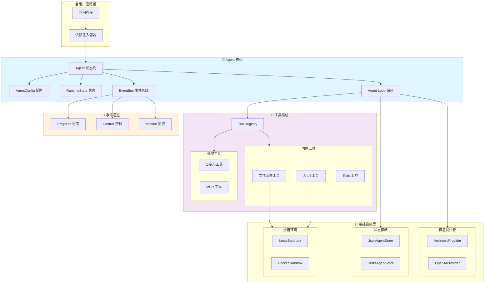
```mermaid
graph TB
    subgraph UserApp["🖥️ 用户应用层"]
        App[应用程序]
        DI[依赖注入容器]
    end
    
    subgraph Core["🎯 Agent 核心"]
        Agent[Agent 状态机]
        Config[AgentConfig 配置]
        State[RuntimeState 状态]
        EventBus[EventBus 事件总线]
        Loop[Agent Loop 循环]
    end
    
    subgraph Infra["🔌 基础设施层"]
        subgraph Providers["模型提供者"]
            Anthropic[AnthropicProvider]
            OpenAI[OpenAIProvider]
        end
        
        subgraph Stores["状态存储"]
            JsonStore[JsonAgentStore]
            RedisStore[RedisAgentStore]
        end
        
        subgraph Sandboxes["沙箱环境"]
            LocalSandbox[LocalSandbox]
            DockerSandbox[DockerSandbox]
        end
    end
    
    subgraph ToolSystem["🔧 工具系统"]
        Registry[ToolRegistry]
        
        subgraph BuiltinTools["内置工具"]
            FS[文件系统工具]
            Shell[Shell 工具]
            Todo[Todo 工具]
        end
        
        subgraph External["外部工具"]
            Custom[自定义工具]
            MCP[MCP 工具]
        end
    end
    
    subgraph Events["📡 事件通道"]
        Progress[Progress 进度]
        Control[Control 控制]
        Monitor[Monitor 监控]
    end
    
    App --> DI
    DI --> Agent
    
    Agent --> Config
    Agent --> State
    Agent --> EventBus
    Agent --> Loop
    
    Loop --> Providers
    Loop --> Registry
    Loop --> Stores
    
    Registry --> BuiltinTools
    Registry --> External
    
    FS --> Sandboxes
    Shell --> Sandboxes
    
    EventBus --> Progress
    EventBus --> Control
    EventBus --> Monitor
    
    style Core fill:#e1f5fe
    style ToolSystem fill:#f3e5f5
    style Events fill:#fff3e0
```

---

### 组件依赖关系

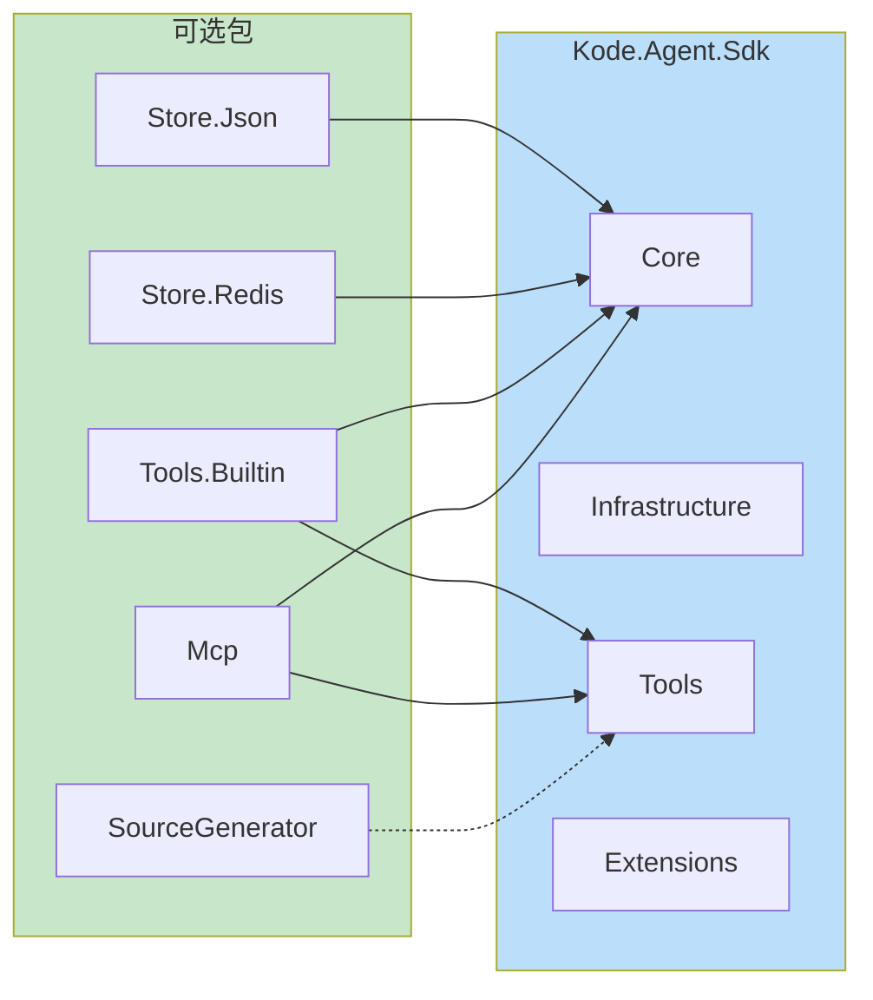
```mermaid
graph LR
    subgraph SDK["Kode.Agent.Sdk"]
        Core[Core]
        Infra[Infrastructure]
        Tools[Tools]
        Extensions[Extensions]
    end
    
    subgraph Packages["可选包"]
        StoreJson[Store.Json]
        StoreRedis[Store.Redis]
        ToolsBuiltin[Tools.Builtin]
        McpPkg[Mcp]
        SourceGen[SourceGenerator]
    end
    
    StoreJson --> Core
    StoreRedis --> Core
    ToolsBuiltin --> Core
    ToolsBuiltin --> Tools
    McpPkg --> Core
    McpPkg --> Tools
    SourceGen -.-> Tools
    
    style SDK fill:#bbdefb
    style Packages fill:#c8e6c9
```

### 核心组件

| 组件 | 职责 |
|------|------|
| **Agent** | 对话状态机，协调消息处理和工具调用 |
| **EventBus** | 事件发布订阅中心，支持三通道 |
| **AgentStore** | 状态持久化接口（JSON/Redis） |
| **ToolRegistry** | 工具注册和发现 |
| **ModelProvider** | LLM 模型抽象层（Anthropic/OpenAI） |
| **Sandbox** | 安全的命令执行环境 |
| **McpToolProvider** | MCP 协议工具提供者 |

---

## Agent 生命周期

### 状态转换图

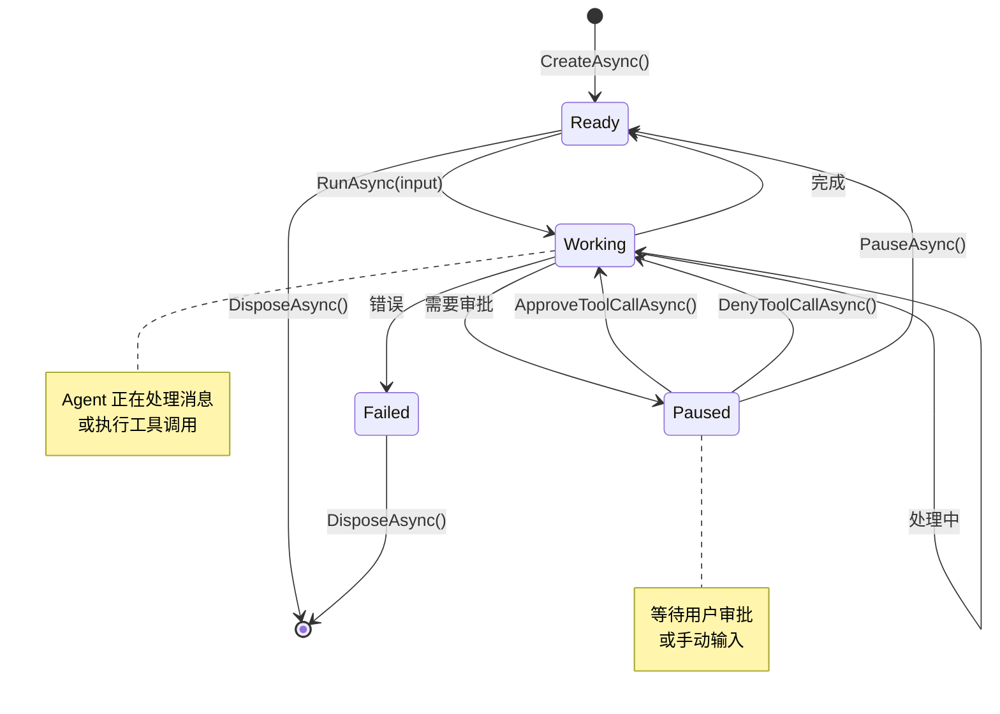
```mermaid
stateDiagram-v2
    [*] --> Ready: CreateAsync()
    
    Ready --> Working: RunAsync(input)
    Working --> Working: 处理中
    Working --> Paused: 需要审批
    Working --> Ready: 完成
    Working --> Failed: 错误
    
    Paused --> Working: ApproveToolCallAsync()
    Paused --> Working: DenyToolCallAsync()
    Paused --> Ready: PauseAsync()
    
    Ready --> [*]: DisposeAsync()
    Failed --> [*]: DisposeAsync()
    
    note right of Working
        Agent 正在处理消息
        或执行工具调用
    end note
    
    note right of Paused
        等待用户审批
        或手动输入
    end note
```

### 断点状态（用于崩溃恢复）

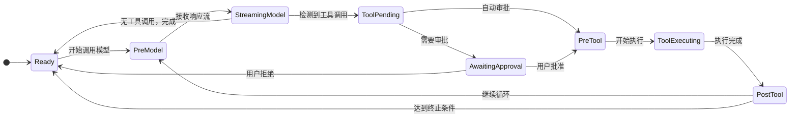
```mermaid
stateDiagram-v2
    direction LR
    
    [*] --> Ready
    Ready --> PreModel: 开始调用模型
    PreModel --> StreamingModel: 接收响应流
    StreamingModel --> ToolPending: 检测到工具调用
    StreamingModel --> Ready: 无工具调用，完成
    
    ToolPending --> AwaitingApproval: 需要审批
    ToolPending --> PreTool: 自动审批
    AwaitingApproval --> PreTool: 用户批准
    AwaitingApproval --> Ready: 用户拒绝
    
    PreTool --> ToolExecuting: 开始执行
    ToolExecuting --> PostTool: 执行完成
    PostTool --> PreModel: 继续循环
    PostTool --> Ready: 达到终止条件
```

Agent 支持以下运行时状态：

| 状态 | 描述 |
|------|------|
| `Ready` | Agent 已创建，准备接收输入 |
| `Working` | Agent 正在处理消息或执行工具 |
| `Paused` | Agent 暂停，等待审批或用户输入 |

| 断点状态 | 描述 |
|----------|------|
| `Ready` | 初始状态 |
| `PreModel` | 即将调用模型 |
| `StreamingModel` | 正在接收模型响应 |
| `ToolPending` | 工具调用等待执行 |
| `AwaitingApproval` | 等待用户审批 |
| `PreTool` | 即将执行工具 |
| `ToolExecuting` | 工具正在执行 |
| `PostTool` | 工具执行完成 |

### 创建 Agent

```csharp
// 方式一：新建 Agent
var agent = await Agent.CreateAsync(
    agentId: "unique-id",
    config: new AgentConfig
    {
        Model = "claude-sonnet-4-20250514",
        SystemPrompt = "You are a helpful assistant.",
        MaxIterations = 20,
        Tools = ["fs_read", "shell_exec"]
    },
    dependencies: deps
);

// 方式二：恢复现有 Agent（TS 对齐：从 meta.json 重建 config）
Agent agent2;
try
{
    agent2 = await Agent.ResumeFromStoreAsync("existing-id", deps);
}
catch
{
    agent2 = await Agent.CreateAsync("existing-id", config, deps);
}
```

### 运行循环

```csharp
// 简单运行
await agent.RunAsync("你好，请帮我分析这个文件");

// 带取消支持
using var cts = new CancellationTokenSource(TimeSpan.FromMinutes(5));
await agent.RunAsync("执行复杂任务", cts.Token);

// 持续对话
await agent.RunAsync("第一个问题");
await agent.RunAsync("跟进问题");
await agent.RunAsync("继续讨论");
```

---

## 事件系统详解

### 三通道架构

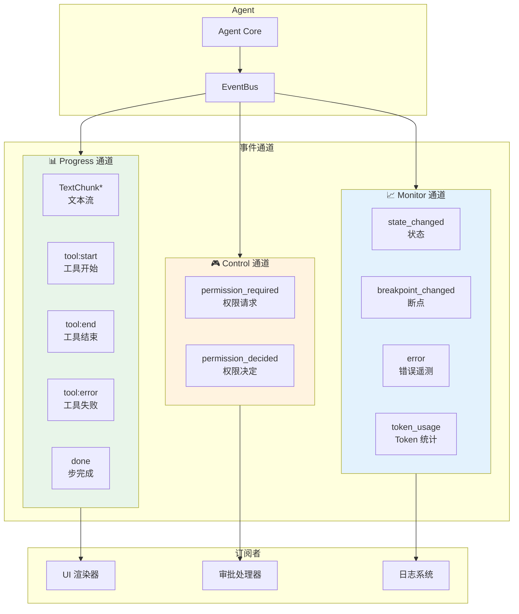
```mermaid
graph TB
    subgraph Agent["Agent"]
        Core[Agent Core]
        EventBus[EventBus]
    end
    
    subgraph Channels["事件通道"]
        subgraph Progress["📊 Progress 通道"]
            TextChunk[TextChunk*<br/>文本流]
            ToolStart[tool:start<br/>工具开始]
            ToolEnd[tool:end<br/>工具结束]
            ToolError[tool:error<br/>工具失败]
            Done[done<br/>步完成]
        end
        
        subgraph Control["🎮 Control 通道"]
            Approval[permission_required<br/>权限请求]
            ApprovalDecided[permission_decided<br/>权限决定]
        end
        
        subgraph Monitor["📈 Monitor 通道"]
            State[state_changed<br/>状态]
            Breakpoint[breakpoint_changed<br/>断点]
            Error[error<br/>错误遥测]
            Token[token_usage<br/>Token 统计]
        end
    end
    
    subgraph Subscribers["订阅者"]
        UI[UI 渲染器]
        Approval_Handler[审批处理器]
        Logger[日志系统]
    end
    
    Core --> EventBus
    EventBus --> Progress
    EventBus --> Control
    EventBus --> Monitor
    
    Progress --> UI
    Control --> Approval_Handler
    Monitor --> Logger
    
    style Progress fill:#e8f5e9
    style Control fill:#fff3e0
    style Monitor fill:#e3f2fd
```

### 事件流时序图

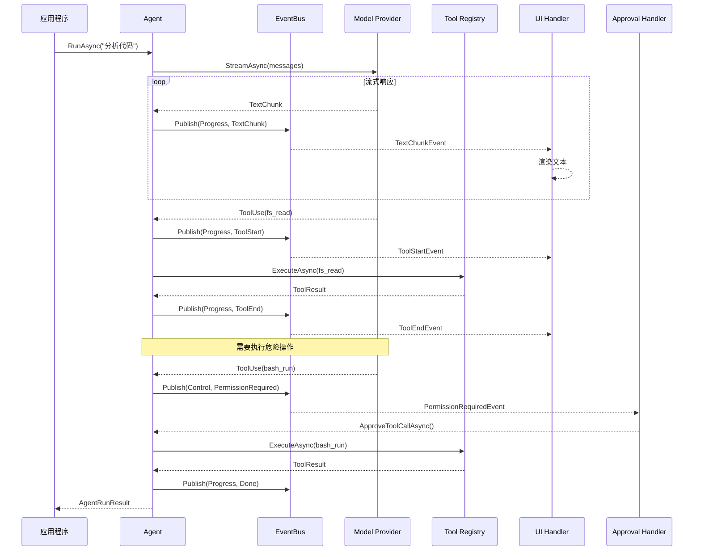
```mermaid
sequenceDiagram
    participant App as 应用程序
    participant Agent
    participant EventBus
    participant Provider as Model Provider
    participant Tool as Tool Registry
    participant UI as UI Handler
    participant Approver as Approval Handler
    
    App->>Agent: RunAsync("分析代码")
    
    Agent->>Provider: StreamAsync(messages)
    
    loop 流式响应
        Provider-->>Agent: TextChunk
        Agent->>EventBus: Publish(Progress, TextChunk)
        EventBus-->>UI: TextChunkEvent
        UI-->>UI: 渲染文本
    end
    
    Provider-->>Agent: ToolUse(fs_read)
    Agent->>EventBus: Publish(Progress, ToolStart)
    EventBus-->>UI: ToolStartEvent
    
    Agent->>Tool: ExecuteAsync(fs_read)
    Tool-->>Agent: ToolResult
    
    Agent->>EventBus: Publish(Progress, ToolEnd)
    EventBus-->>UI: ToolEndEvent
    
    Note over Agent,Provider: 需要执行危险操作
    
    Provider-->>Agent: ToolUse(bash_run)
    Agent->>EventBus: Publish(Control, PermissionRequired)
    EventBus-->>Approver: PermissionRequiredEvent
    
    Approver-->>Agent: ApproveToolCallAsync()
    
    Agent->>Tool: ExecuteAsync(bash_run)
    Tool-->>Agent: ToolResult
    
    Agent->>EventBus: Publish(Progress, Done)
    Agent-->>App: AgentRunResult
```

```csharp
[Flags]
public enum EventChannel
{
    Progress = 1, // 实时进度：文本流、工具执行状态
    Control = 2,  // 控制流：审批请求/决定
    Monitor = 4,  // 可观测性：状态/断点/错误/指标
    All = Progress | Control | Monitor
}
```

### 事件类型

SDK 的事件 JSON 形状严格对齐 TS `src/core/types.ts`：

```csharp
// EventEnvelope（TS 对齐）：{ cursor, bookmark, event }
// 其中 event 本体也带 channel/type/bookmark：
// event.channel: "progress" | "control" | "monitor"
// event.type: string
// event.bookmark?: Bookmark

// Progress（示例）
// - text_chunk_start: { step }
// - text_chunk: { step, delta }
// - text_chunk_end: { step, text }
// - tool:start / tool:end: { call: ToolCallSnapshot }
// - tool:error: { call: ToolCallSnapshot, error }
// - done: { step, reason: "completed" | "interrupted" }

// Control（示例）
// - permission_required: { call: ToolCallSnapshot } + respond(decision, { note? })（仅本地回调，不持久化）
// - permission_decided: { callId, decision: "allow" | "deny", decidedBy, note? }

// Monitor（示例）
// - state_changed: { state }
// - breakpoint_changed: { previous, current, timestamp }
// - error: { severity, phase, message, detail? }
// - token_usage: { inputTokens, outputTokens, totalTokens }
```

### 事件订阅模式

```csharp
// 并行处理多个通道
var progressTask = Task.Run(async () =>
{
    await foreach (var e in agent.EventBus.SubscribeAsync(EventChannel.Progress))
    {
        // 处理 Progress 事件
    }
});

var controlTask = Task.Run(async () =>
{
    await foreach (var e in agent.EventBus.SubscribeAsync(EventChannel.Control))
    {
        // 处理 Control 事件
    }
});

// 运行 Agent
await agent.RunAsync("开始任务");

// 等待事件处理完成
await Task.WhenAll(progressTask, controlTask);
```

---

## 工具开发指南

### 工具执行流程

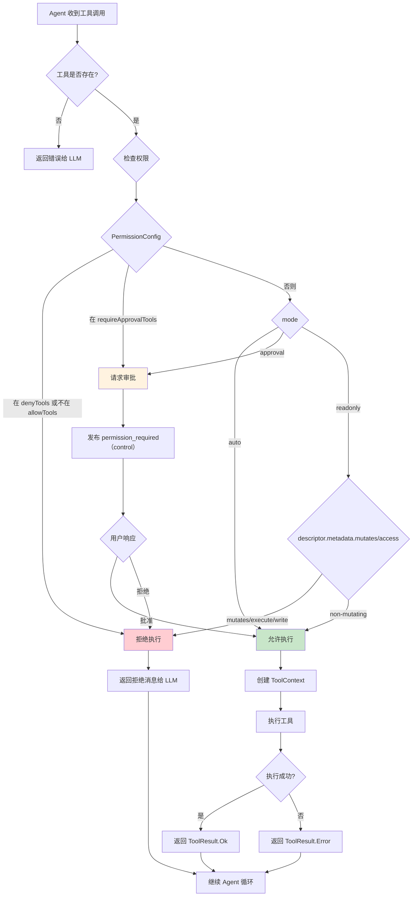
```mermaid
flowchart TD
    A[Agent 收到工具调用] --> B{工具是否存在?}
    B -->|否| C[返回错误给 LLM]
    B -->|是| D{检查权限}

    D --> E{PermissionConfig}
    E -->|在 denyTools 或不在 allowTools| I[拒绝执行]
    E -->|在 requireApprovalTools| G[请求审批]
    E -->|否则| J{mode}

    J -->|auto| F[允许执行]
    J -->|approval| G
    J -->|readonly| K{descriptor.metadata.mutates/access}
    K -->|mutates/execute/write| I
    K -->|non-mutating| F

    G --> L[发布 permission_required（control）]
    L --> M{用户响应}
    M -->|批准| F
    M -->|拒绝| I
    
    F --> N[创建 ToolContext]
    N --> O[执行工具]
    O --> P{执行成功?}
    P -->|是| Q[返回 ToolResult.Ok]
    P -->|否| R[返回 ToolResult.Error]
    
    I --> S[返回拒绝消息给 LLM]
    
    Q --> T[继续 Agent 循环]
    R --> T
    S --> T
    
    style F fill:#c8e6c9
    style G fill:#fff3e0
    style I fill:#ffcdd2
```

### 工具接口

```csharp
public interface ITool
{
    string Name { get; }
    string Description { get; }
    JsonElement InputSchema { get; }
    
    Task<ToolResult> ExecuteAsync(
        JsonElement input,
        ToolContext context,
        CancellationToken cancellationToken = default
    );
}
```

### 使用 Source Generator

Source Generator 在编译时生成工具的 Schema 和验证代码，避免运行时反射。

```csharp
using Kode.Agent.Sdk.Tools;

[Tool("database_query")]
[Description("Execute SQL query on the database")]
[Category("database")]
public partial class DatabaseQueryTool : ITool
{
    [ToolParameter("query", required: true)]
    [Description("SQL query to execute")]
    public string Query { get; set; } = "";
    
    [ToolParameter("database")]
    [Description("Database name, defaults to 'main'")]
    public string Database { get; set; } = "main";
    
    [ToolParameter("timeout")]
    [Description("Query timeout in seconds")]
    public int Timeout { get; set; } = 30;

    public async Task<ToolResult> ExecuteAsync(ToolContext context)
    {
        try
        {
            using var connection = new SqlConnection(GetConnectionString(Database));
            using var command = new SqlCommand(Query, connection)
            {
                CommandTimeout = Timeout
            };
            
            await connection.OpenAsync(context.CancellationToken);
            using var reader = await command.ExecuteReaderAsync(context.CancellationToken);
            
            var results = await ReadResultsAsync(reader);
            return ToolResult.Success(JsonSerializer.Serialize(results));
        }
        catch (Exception ex)
        {
            return ToolResult.Error($"Query failed: {ex.Message}");
        }
    }
}
```

编译后生成的代码：

```csharp
// 自动生成 - 不要手动编辑
public partial class DatabaseQueryTool
{
    public string Name => "database_query";
    public string Description => "Execute SQL query on the database";
    
    public JsonElement InputSchema => JsonDocument.Parse("""
    {
        "type": "object",
        "properties": {
            "query": {
                "type": "string",
                "description": "SQL query to execute"
            },
            "database": {
                "type": "string",
                "description": "Database name, defaults to 'main'"
            },
            "timeout": {
                "type": "integer",
                "description": "Query timeout in seconds"
            }
        },
        "required": ["query"]
    }
    """).RootElement;
}
```

### 工具注册

```csharp
// 单个工具
toolRegistry.Register<DatabaseQueryTool>();

// 批量注册
toolRegistry.RegisterFromAssembly(typeof(DatabaseQueryTool).Assembly);

// 动态注册
toolRegistry.Register(new ToolDefinition
{
    Name = "custom_tool",
    Description = "A dynamically registered tool",
    InputSchema = schema
}, ExecuteCustomTool);
```

### 工具上下文

```csharp
public record ToolContext(
    string AgentId,
    ISandbox Sandbox,
    ILogger Logger,
    CancellationToken CancellationToken
);
```

---

## Skills 系统

Skills 是一种渐进式披露机制，允许 Agent 按需发现和激活额外的能力，而不是一开始就加载所有内容到上下文中。

### Skills 架构

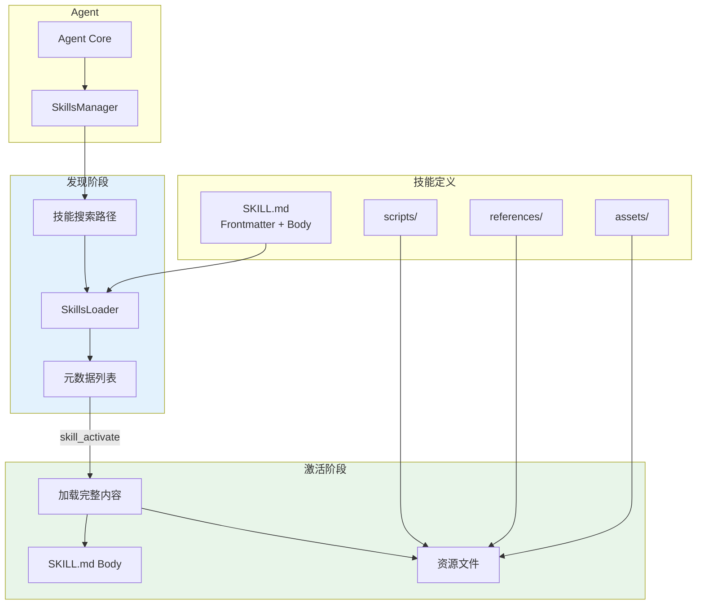
```mermaid
graph TB
    subgraph Agent["Agent"]
        Core[Agent Core]
        SM[SkillsManager]
    end
    
    subgraph Discovery["发现阶段"]
        Paths[技能搜索路径]
        Loader[SkillsLoader]
        Metadata[元数据列表]
    end
    
    subgraph Activation["激活阶段"]
        FullLoad[加载完整内容]
        Body[SKILL.md Body]
        Resources[资源文件]
    end
    
    subgraph SkillDef["技能定义"]
        MD[SKILL.md<br/>Frontmatter + Body]
        Scripts[scripts/]
        Refs[references/]
        Assets[assets/]
    end
    
    Core --> SM
    SM --> Paths
    Paths --> Loader
    Loader --> Metadata
    
    Metadata -->|skill_activate| FullLoad
    FullLoad --> Body
    FullLoad --> Resources
    
    MD --> Loader
    Scripts --> Resources
    Refs --> Resources
    Assets --> Resources
    
    style Discovery fill:#e3f2fd
    style Activation fill:#e8f5e9
```

### Skills 生命周期

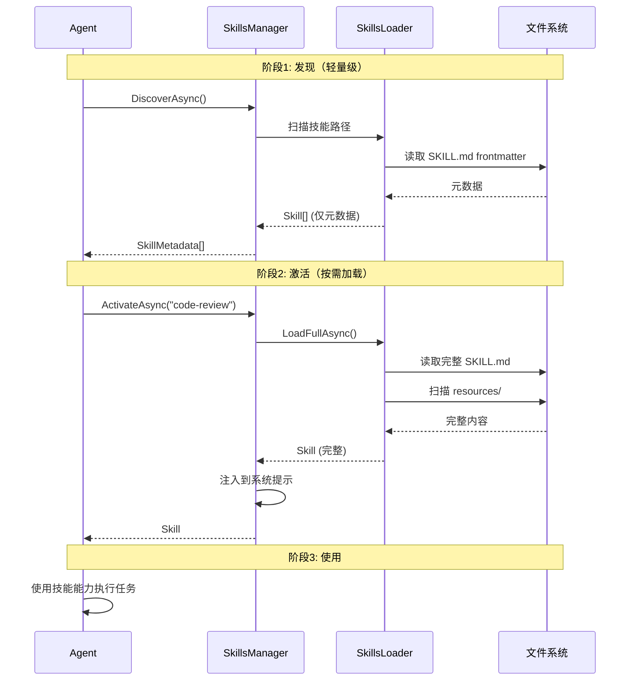
```mermaid
sequenceDiagram
    participant Agent
    participant SM as SkillsManager
    participant Loader as SkillsLoader
    participant FS as 文件系统
    
    Note over Agent,FS: 阶段1: 发现（轻量级）
    Agent->>SM: DiscoverAsync()
    SM->>Loader: 扫描技能路径
    Loader->>FS: 读取 SKILL.md frontmatter
    FS-->>Loader: 元数据
    Loader-->>SM: Skill[] (仅元数据)
    SM-->>Agent: SkillMetadata[]
    
    Note over Agent,FS: 阶段2: 激活（按需加载）
    Agent->>SM: ActivateAsync("code-review")
    SM->>Loader: LoadFullAsync()
    Loader->>FS: 读取完整 SKILL.md
    Loader->>FS: 扫描 resources/
    FS-->>Loader: 完整内容
    Loader-->>SM: Skill (完整)
    SM->>SM: 注入到系统提示
    SM-->>Agent: Skill
    
    Note over Agent,FS: 阶段3: 使用
    Agent->>Agent: 使用技能能力执行任务
```

### SKILL.md 格式

```markdown
---
name: code-review
description: 代码审查技能，帮助识别代码问题和改进建议
license: Apache-2.0
compatibility: claude-3.5-sonnet, gpt-4o
allowedTools:
  - fs_read
  - fs_grep
  - fs_glob
---

# 代码审查指南

## 审查重点
1. 代码风格和一致性
2. 潜在的 bug 和边界情况
3. 性能优化机会
4. 安全漏洞检查

## 输出格式
请使用以下格式输出审查结果：
- 🔴 严重问题
- 🟡 建议改进
- 🟢 良好实践
```

### 技能目录结构

```
skills/
├── code-review/
│   ├── SKILL.md           # 技能定义（必需）
│   └── resources/
│       ├── scripts/       # 可执行脚本
│       ├── references/    # 参考文档
│       └── assets/        # 资源文件
├── testing/
│   ├── SKILL.md
│   └── resources/
└── documentation/
    └── SKILL.md
```

### 配置 Skills

```csharp
var skillsConfig = new SkillsConfig
{
    // 技能搜索路径
    Paths = ["./.kode/skills", "./skills"],
    
    // 白名单：只加载这些技能
    Include = ["code-review", "testing"],
    
    // 黑名单：排除这些技能
    Exclude = ["deprecated-skill"],
    
    // 受信任源：允许脚本执行
    Trusted = ["code-review"],
    
    // 加载时验证格式
    ValidateOnLoad = true
};

// 创建技能管理器
var skillsManager = new SkillsManager(skillsConfig, sandbox, store, agentId);

// 发现技能（轻量级，只读元数据）
var skills = await skillsManager.DiscoverAsync();

// 激活技能（按需加载完整内容）
var skill = await skillsManager.ActivateAsync("code-review");
```

### 技能工具

| 工具 | 描述 |
|------|------|
| `skill_list` | 列出可用技能及其激活状态 |
| `skill_activate` | 激活指定技能 |
| `skill_resource` | 读取技能资源文件 |

```csharp
// Agent 可以通过工具自主管理技能
// skill_list - 查看可用技能
// skill_activate - 激活需要的技能
// skill_resource - 读取技能资源
```

---

## Sub-Agent 任务委派

Sub-Agent 机制允许主 Agent 将复杂任务委派给专门的子 Agent，实现分工协作和工作流编排。

### Sub-Agent 架构

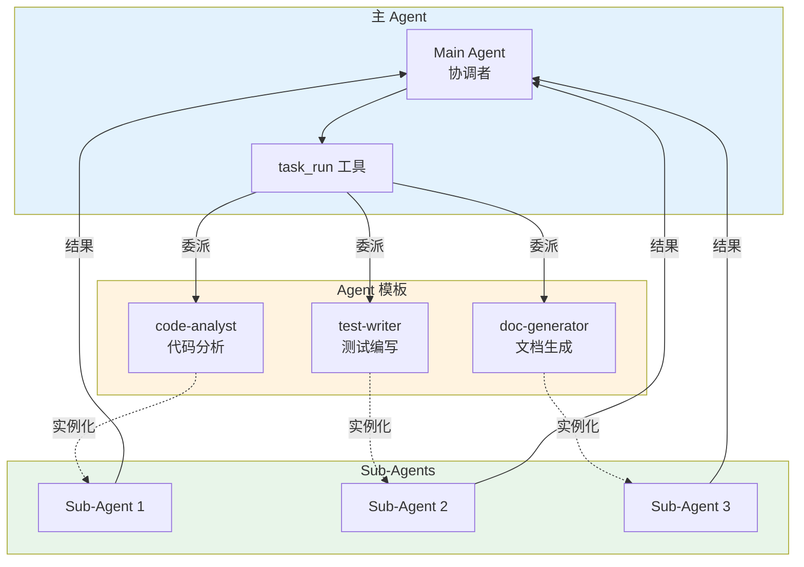
```mermaid
graph TB
    subgraph Main["主 Agent"]
        MainAgent[Main Agent<br/>协调者]
        TaskRun[task_run 工具]
    end
    
    subgraph Templates["Agent 模板"]
        T1[code-analyst<br/>代码分析]
        T2[test-writer<br/>测试编写]
        T3[doc-generator<br/>文档生成]
    end
    
    subgraph SubAgents["Sub-Agents"]
        SA1[Sub-Agent 1]
        SA2[Sub-Agent 2]
        SA3[Sub-Agent 3]
    end
    
    MainAgent --> TaskRun
    TaskRun -->|委派| T1
    TaskRun -->|委派| T2
    TaskRun -->|委派| T3
    
    T1 -.->|实例化| SA1
    T2 -.->|实例化| SA2
    T3 -.->|实例化| SA3
    
    SA1 -->|结果| MainAgent
    SA2 -->|结果| MainAgent
    SA3 -->|结果| MainAgent
    
    style Main fill:#e3f2fd
    style Templates fill:#fff3e0
    style SubAgents fill:#e8f5e9
```

### 任务委派流程

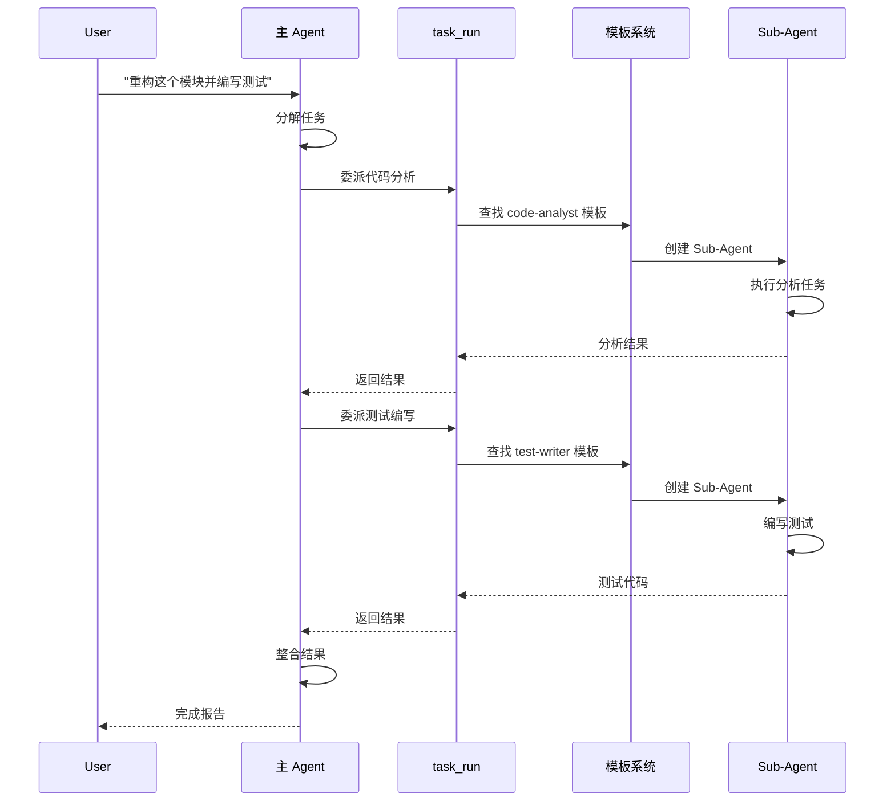
```mermaid
sequenceDiagram
    participant User
    participant Main as 主 Agent
    participant TaskRun as task_run
    participant Template as 模板系统
    participant SubAgent as Sub-Agent
    
    User->>Main: "重构这个模块并编写测试"
    
    Main->>Main: 分解任务
    
    Main->>TaskRun: 委派代码分析
    TaskRun->>Template: 查找 code-analyst 模板
    Template->>SubAgent: 创建 Sub-Agent
    SubAgent->>SubAgent: 执行分析任务
    SubAgent-->>TaskRun: 分析结果
    TaskRun-->>Main: 返回结果
    
    Main->>TaskRun: 委派测试编写
    TaskRun->>Template: 查找 test-writer 模板
    Template->>SubAgent: 创建 Sub-Agent
    SubAgent->>SubAgent: 编写测试
    SubAgent-->>TaskRun: 测试代码
    TaskRun-->>Main: 返回结果
    
    Main->>Main: 整合结果
    Main-->>User: 完成报告
```

### 定义 Agent 模板

```csharp
var templates = new List<AgentTemplate>
{
    new AgentTemplate
    {
        Id = "code-analyst",
        System = "你是一个专业的代码分析师。专注于代码质量、架构和潜在问题。",
        Tools = ["fs_read", "fs_grep", "fs_glob"],
        WhenToUse = "分析代码结构、识别问题、提供改进建议"
    },
    new AgentTemplate
    {
        Id = "test-writer",
        System = "你是一个测试工程师。专注于编写全面的单元测试和集成测试。",
        Tools = ["fs_read", "fs_write", "bash_run"],
        WhenToUse = "编写测试用例、提高代码覆盖率"
    },
    new AgentTemplate
    {
        Id = "doc-generator",
        System = "你是一个技术文档专家。专注于生成清晰、准确的文档。",
        Tools = ["fs_read", "fs_write"],
        WhenToUse = "生成 API 文档、README、使用指南"
    }
};

// 创建 task_run 工具
var taskRunTool = TaskRunToolFactory.Create(templates);
toolRegistry.Register(taskRunTool);
```

### 使用 task_run 工具

Agent 通过 `task_run` 工具委派任务：

```json
{
  "tool": "task_run",
  "arguments": {
    "agent_template_id": "code-analyst",
    "description": "分析用户认证模块",
    "prompt": "请分析 src/auth/ 目录下的代码，识别安全漏洞和改进机会",
    "context": "这是一个使用 JWT 的 Node.js 应用"
  }
}
```

### Sub-Agent 配置

```csharp
// 在模板中配置 Sub-Agent 行为
var runtimeConfig = new TemplateRuntimeConfig
{
    SubAgents = new SubAgentConfig
    {
        // 允许使用的模板
        Templates = ["code-analyst", "test-writer"],
        
        // 最大嵌套深度（防止无限递归）
        Depth = 2,
        
        // 继承父配置
        InheritConfig = true,
        
        // 覆盖配置
        Overrides = new SubAgentOverrides
        {
            Permission = new PermissionConfig
            {
                Mode = "approval"
            }
        }
    }
};
```

### Sub-Agent vs Skills

| 特性 | Skills | Sub-Agent |
|------|--------|-----------|
| **用途** | 扩展单个 Agent 的能力 | 将任务委派给专门的 Agent |
| **执行** | 在同一 Agent 上下文中 | 独立的 Agent 实例 |
| **状态** | 共享 Agent 状态 | 隔离的状态 |
| **适用场景** | 添加特定领域知识 | 复杂多步骤任务分解 |
| **开销** | 轻量级 | 较重（新 Agent 实例） |

---

## 模型提供者深入

### 自定义提供者

```csharp
public class CustomProvider : IModelProvider
{
    public string Name => "custom";
    
    public async IAsyncEnumerable<StreamingContent> StreamAsync(
        IReadOnlyList<Message> messages,
        ModelOptions options,
        IReadOnlyList<ToolDefinition> tools,
        [EnumeratorCancellation] CancellationToken cancellationToken = default)
    {
        // 1. 构建请求
        var request = BuildRequest(messages, options, tools);
        
        // 2. 发送请求并获取流
        var stream = await SendStreamingRequest(request, cancellationToken);
        
        // 3. 解析并产出内容
        await foreach (var chunk in ParseStream(stream, cancellationToken))
        {
            if (chunk.IsText)
            {
                yield return new TextContent(chunk.Text);
            }
            else if (chunk.IsToolCall)
            {
                yield return new ToolCallContent(
                    chunk.ToolId,
                    chunk.ToolName,
                    chunk.Arguments
                );
            }
        }
    }
}
```

### 提供者选项

```csharp
// Anthropic 选项
public class AnthropicOptions
{
    public string ApiKey { get; set; } = "";
    public string? BaseUrl { get; set; }
    public string? ModelId { get; set; }
    public int MaxTokens { get; set; } = 8192;
    public bool EnableBetaFeatures { get; set; } = false;
    public Dictionary<string, string> CustomHeaders { get; set; } = new();
}

// OpenAI 选项
public class OpenAIOptions
{
    public string ApiKey { get; set; } = "";
    public string? BaseUrl { get; set; }
    public string? Organization { get; set; }
    public string DefaultModel { get; set; } = "gpt-4o";
    public int MaxTokens { get; set; } = 4096;
}
```

---

## 错误处理

### 异常类型

```csharp
// 基础异常
public class KodeAgentException : Exception { }

// 提供者错误
public class ProviderException : KodeAgentException
{
    public string ProviderName { get; }
    public int? StatusCode { get; }
}

// 工具执行错误
public class ToolExecutionException : KodeAgentException
{
    public string ToolName { get; }
    public JsonElement Input { get; }
}

// 配置错误
public class ConfigurationException : KodeAgentException { }
```

### 错误处理模式

```csharp
try
{
    await agent.RunAsync("执行任务");
}
catch (ProviderException ex) when (ex.StatusCode == 429)
{
    // 速率限制，等待重试
    await Task.Delay(TimeSpan.FromSeconds(60));
    await agent.RunAsync("执行任务");
}
catch (ProviderException ex) when (ex.StatusCode == 401)
{
    // API 密钥无效
    throw new ConfigurationException("Invalid API key", ex);
}
catch (ToolExecutionException ex)
{
    // 工具执行失败
    logger.LogError(ex, "Tool {Tool} failed", ex.ToolName);
    // Agent 会自动向 LLM 报告错误
}
catch (OperationCanceledException)
{
    // 任务被取消
    // TS 对齐：运行中会持续持久化 messages/tool-calls/todos/meta/events；
    // 如需保留一个“可 fork 的安全分叉点”，使用 Snapshot。
    await agent.SnapshotAsync();
}
```

### 通过事件处理错误

```csharp
await foreach (var envelope in agent.EventBus.SubscribeAsync(EventChannel.Progress))
{
    if (envelope.Event is ErrorEvent error)
    {
        logger.LogError(error.Exception, "Agent error occurred");
        
        if (error.Exception is ProviderException pe && pe.StatusCode == 429)
        {
            // 通知用户速率限制
            Console.WriteLine("请求过于频繁，请稍后再试");
        }
    }
}
```

---

## 最佳实践

### 1. 使用 Serilog 结构化日志

推荐使用 Serilog 进行结构化日志记录：

```csharp
using Serilog;
using Serilog.Events;

// 配置 Serilog（在创建 WebApplication 之前）
Log.Logger = new LoggerConfiguration()
    .MinimumLevel.Information()
    .MinimumLevel.Override("Microsoft", LogEventLevel.Warning)
    .MinimumLevel.Override("Microsoft.AspNetCore", LogEventLevel.Warning)
    .Enrich.FromLogContext()
    .WriteTo.Console(
        outputTemplate: "[{Timestamp:HH:mm:ss} {Level:u3}] {SourceContext}{NewLine}{Message:lj}{NewLine}{Exception}")
    .WriteTo.File(
        "logs/kode-.log",
        rollingInterval: RollingInterval.Day,
        outputTemplate: "{Timestamp:yyyy-MM-dd HH:mm:ss.fff zzz} [{Level:u3}] {Message:lj}{NewLine}{Exception}",
        retainedFileCountLimit: 7)
    .CreateLogger();

try
{
    Log.Information("Starting Kode.Agent WebApi Assistant");

    var builder = WebApplication.CreateBuilder(args);
    builder.Host.UseSerilog();  // 使用 Serilog

    // ... 服务配置 ...

    var app = builder.Build();
    Log.Information("Application started successfully");
    app.Run();
}
catch (Exception ex)
{
    Log.Fatal(ex, "Application terminated unexpectedly");
}
finally
{
    Log.CloseAndFlush();
}
```

**对于非 WebAPI 应用：**
```csharp
// 使用依赖注入
var services = new ServiceCollection();
services.AddSingleton<ILoggerFactory>(sp =>
{
    var loggerFactory = LoggerFactory.Create(builder =>
    {
        builder.AddSerilog();  // 集成 Serilog
    });
    return loggerFactory;
});

var deps = new AgentDependencies
{
    LoggerFactory = services.BuildServiceProvider().GetRequiredService<ILoggerFactory>(),
    // ...
};
```

### 2. 合理设置超时

```csharp
// Agent 级别
var config = new AgentConfig
{
    MaxIterations = 20,           // 限制迭代次数
    IterationTimeout = TimeSpan.FromMinutes(2),  // 单次迭代超时
    TotalTimeout = TimeSpan.FromMinutes(30)      // 总超时
};

// 工具级别
using var cts = CancellationTokenSource.CreateLinkedTokenSource(
    context.CancellationToken
);
cts.CancelAfter(TimeSpan.FromSeconds(30));

await ExecuteLongOperation(cts.Token);
```

### 3. 实现优雅关闭

```csharp
var cts = new CancellationTokenSource();
Console.CancelKeyPress += (s, e) =>
{
    e.Cancel = true;
    cts.Cancel();
};

try
{
    await agent.RunAsync("长时间任务", cts.Token);
}
catch (OperationCanceledException)
{
    Console.WriteLine("正在保存状态...");
    await agent.SnapshotAsync();
    Console.WriteLine("已安全退出");
}
```

### 4. 资源管理

```csharp
// 使用 using 确保清理
await using var agent = await Agent.CreateAsync(id, config, deps);
await agent.RunAsync("任务");

// 或手动管理
var agent = await Agent.CreateAsync(id, config, deps);
try
{
    await agent.RunAsync("任务");
}
finally
{
    await agent.DisposeAsync();
}
```

### 5. 工具权限控制

```csharp
// 创建受限工具集
var safeTools = new[] { "fs_read", "fs_glob" };  // 只读操作

var config = new AgentConfig
{
    Tools = safeTools,
    // ...
};

// 或使用工具包装器实现权限检查
toolRegistry.Register(
    new PermissionWrapper(
        innerTool: new ShellExecTool(),
        allowedCommands: ["ls", "cat", "grep"]
    )
);
```

### 6. 会话管理

```csharp
// 基于会话ID管理多个Agent
public class SessionManager
{
    private readonly ConcurrentDictionary<string, Agent> _sessions = new();
    
    public async Task<Agent> GetOrCreateAsync(string sessionId)
    {
        return await _sessions.GetOrAddAsync(sessionId, async id =>
        {
            try
            {
                return await Agent.ResumeFromStoreAsync(id, _deps);
            }
            catch
            {
                return await Agent.CreateAsync(id, _config, _deps);
            }
        });
    }
    
    public async Task EndSessionAsync(string sessionId)
    {
        if (_sessions.TryRemove(sessionId, out var agent))
        {
            await agent.DisposeAsync();
        }
    }
}
```

---

## 常见问题

### Q: 如何处理大文件？

```csharp
// 使用流式读取
var tool = new StreamingFileReader();
await foreach (var chunk in tool.ReadChunksAsync(filePath))
{
    // 处理块
}
```

### Q: 如何限制 Token 使用？

```csharp
var config = new AgentConfig
{
    MaxTokensPerIteration = 4096,
    MaxTotalTokens = 50000
};
```

### Q: 如何切换模型？

```csharp
// 可以在运行时切换
agent.Config.Model = "claude-3-5-haiku-20241022";

// 或为不同任务使用不同配置
var fastConfig = config with { Model = "claude-3-5-haiku-20241022" };
var smartConfig = config with { Model = "claude-sonnet-4-20250514" };
```

---

## 示例项目

查看 `examples/` 目录获取更多示例：

- **GettingStarted** - 基础用法
- **AgentInbox** - 多 Agent 协作
- **ApprovalControl** - 人工审批流程
- **RoomCollab** - 实时协作场景
- **CustomToolsExample** - 自定义工具开发
- **HooksUsage** - 生命周期钩子
- **TemplateUsage** - Agent 模板系统
- **SchedulerUsage** - 定时任务调度
- **EventBusUsage** - 事件总线详解

```bash
cd examples/Kode.Agent.Examples
dotnet run
```

---

## MCP 协议集成

SDK 原生支持 [Model Context Protocol (MCP)](https://modelcontextprotocol.io/)，可轻松接入外部工具生态。

### MCP 架构图

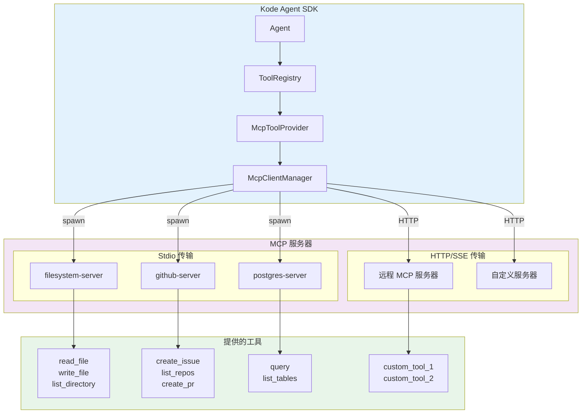
```mermaid
graph TB
    subgraph KodeAgent["Kode Agent SDK"]
        Agent[Agent]
        Registry[ToolRegistry]
        McpProvider[McpToolProvider]
        McpClient[McpClientManager]
    end
    
    subgraph McpServers["MCP 服务器"]
        subgraph Stdio["Stdio 传输"]
            FS[filesystem-server]
            GitHub[github-server]
            Postgres[postgres-server]
        end
        
        subgraph HTTP["HTTP/SSE 传输"]
            Remote[远程 MCP 服务器]
            Custom[自定义服务器]
        end
    end
    
    subgraph Tools["提供的工具"]
        FSTools[read_file<br/>write_file<br/>list_directory]
        GitTools[create_issue<br/>list_repos<br/>create_pr]
        DBTools[query<br/>list_tables]
        RemoteTools[custom_tool_1<br/>custom_tool_2]
    end
    
    Agent --> Registry
    Registry --> McpProvider
    McpProvider --> McpClient
    
    McpClient -->|spawn| FS
    McpClient -->|spawn| GitHub
    McpClient -->|spawn| Postgres
    McpClient -->|HTTP| Remote
    McpClient -->|HTTP| Custom
    
    FS --> FSTools
    GitHub --> GitTools
    Postgres --> DBTools
    Remote --> RemoteTools
    
    style KodeAgent fill:#e3f2fd
    style McpServers fill:#f3e5f5
    style Tools fill:#e8f5e9
```

### MCP 通信流程

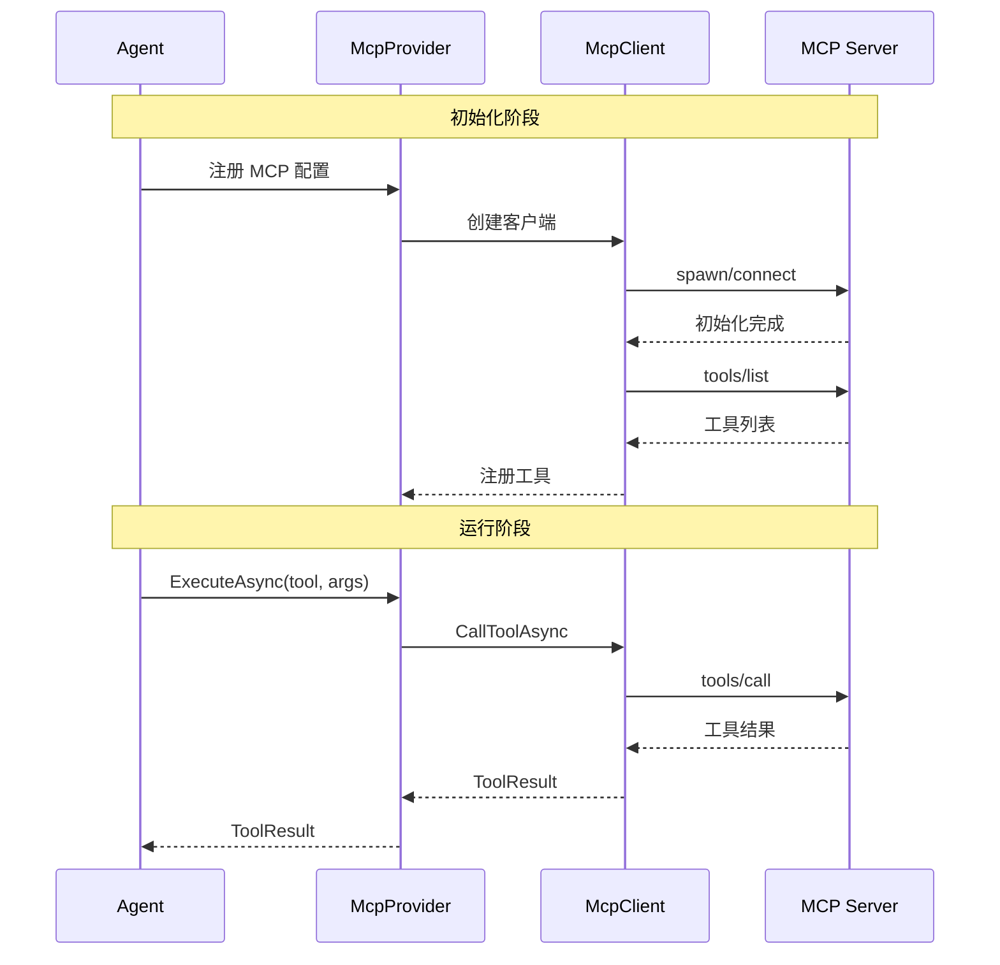
```mermaid
sequenceDiagram
    participant Agent
    participant McpProvider
    participant McpClient
    participant Server as MCP Server
    
    Note over Agent,Server: 初始化阶段
    Agent->>McpProvider: 注册 MCP 配置
    McpProvider->>McpClient: 创建客户端
    McpClient->>Server: spawn/connect
    Server-->>McpClient: 初始化完成
    McpClient->>Server: tools/list
    Server-->>McpClient: 工具列表
    McpClient-->>McpProvider: 注册工具
    
    Note over Agent,Server: 运行阶段
    Agent->>McpProvider: ExecuteAsync(tool, args)
    McpProvider->>McpClient: CallToolAsync
    McpClient->>Server: tools/call
    Server-->>McpClient: 工具结果
    McpClient-->>McpProvider: ToolResult
    McpProvider-->>Agent: ToolResult
```

### 什么是 MCP？

MCP 是一个开放协议，允许 AI 模型与外部工具和数据源进行标准化交互。通过 MCP，您可以：

- 连接到数千个现有的 MCP 服务器
- 统一管理来自不同来源的工具
- 无需编写适配器代码

### 配置 MCP 服务器

```csharp
using Kode.Agent.Mcp;

// Stdio 传输（子进程方式）
var stdioConfig = new McpConfig
{
    Transport = McpTransportType.Stdio,
    Command = "npx",
    Args = ["-y", "@modelcontextprotocol/server-filesystem", "/workspace"],
    ServerName = "filesystem",
    Environment = new Dictionary<string, string>
    {
        ["NODE_ENV"] = "production"
    }
};

// HTTP/SSE 传输
var httpConfig = new McpConfig
{
    Transport = McpTransportType.Http,
    Url = "http://localhost:3000/mcp",
    Headers = new Dictionary<string, string>
    {
        ["Authorization"] = "Bearer your-token"
    },
    ServerName = "remote-server"
};
```

### 从 appsettings.json 加载 MCP 服务器

在 WebAPI 应用中，可以使用 `McpServersLoader` 从配置文件加载 MCP 服务器：

**appsettings.json:**
```json
{
  "Kode": {
    "AllowTools": "*,fs_read,fs_write,fs_edit,fs_grep,fs_glob,fs_multi_edit"
  },
  "McpServers": {
    "chrome-devtools": {
      "command": "npx",
      "args": ["-y", "chrome-devtools-mcp@latest"]
    },
    "filesystem": {
      "command": "npx",
      "args": ["-y", "@modelcontextprotocol/server-filesystem", "/workspace"],
      "env": {
        "NODE_ENV": "production"
      }
    },
    "remote-server": {
      "transport": "http",
      "url": "https://api.example.com/mcp",
      "headers": {
        "Authorization": "Bearer your-token"
      }
    }
  }
}
```

**Program.cs:**
```csharp
// 注册 MCP 服务
builder.Services.AddMcpClientManager();
builder.Services.AddSingleton<McpServersLoader>();

var app = builder.Build();

// 启动时加载 MCP 工具
var mcpLoader = app.Services.GetRequiredService<McpServersLoader>();
var toolRegistry = app.Services.GetRequiredService<IToolRegistry>();
var mcpToolCount = await mcpLoader.LoadAndRegisterServersAsync(
    builder.Configuration,
    toolRegistry,
    CancellationToken.None);

Log.Information("[MCP] Loaded {Count} tools from MCP servers", mcpToolCount);
```

### 工具过滤

```csharp
var config = new McpConfig
{
    Transport = McpTransportType.Stdio,
    Command = "npx",
    Args = ["-y", "@modelcontextprotocol/server-github"],
    // 只包含特定工具
    Include = ["create_issue", "list_issues", "get_issue"],
    // 或排除特定工具
    Exclude = ["delete_repository"]
};
```

### 在依赖注入中使用

```csharp
services.AddMcpToolProvider(options =>
{
    options.Configs = new[]
    {
        new McpConfig
        {
            Transport = McpTransportType.Stdio,
            Command = "npx",
            Args = ["-y", "@modelcontextprotocol/server-filesystem", "/tmp"],
            ServerName = "filesystem"
        },
        new McpConfig
        {
            Transport = McpTransportType.Stdio,
            Command = "npx",
            Args = ["-y", "@modelcontextprotocol/server-github"],
            ServerName = "github",
            Environment = new Dictionary<string, string>
            {
                ["GITHUB_TOKEN"] = Configuration["GitHub:Token"]!
            }
        }
    };
});
```

### 常用 MCP 服务器

| 服务器 | 描述 | 安装命令 |
|--------|------|----------|
| filesystem | 文件系统操作 | `npx @modelcontextprotocol/server-filesystem` |
| github | GitHub API | `npx @modelcontextprotocol/server-github` |
| postgres | PostgreSQL 数据库 | `npx @modelcontextprotocol/server-postgres` |
| memory | 知识图谱存储 | `npx @modelcontextprotocol/server-memory` |
| brave-search | 网络搜索 | `npx @anthropic-ai/mcp-server-brave-search` |

---

## 权限控制系统

SDK 提供灵活且细粒度的权限控制机制，确保 Agent 在安全边界内运行。

### 权限决策流程

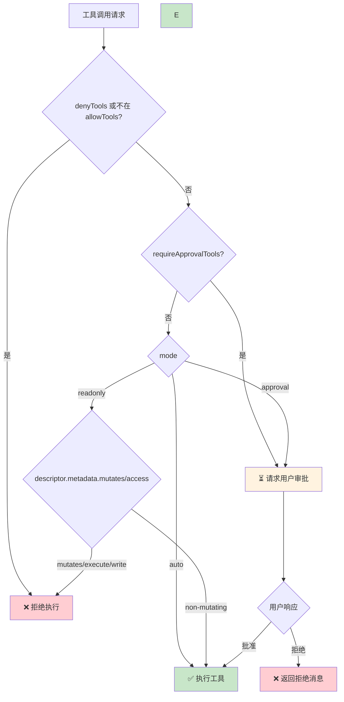
```mermaid
flowchart TD
    A[工具调用请求] --> B{denyTools 或不在 allowTools?}
    B -->|是| C[❌ 拒绝执行]
    B -->|否| D{requireApprovalTools?}
    D -->|是| G[⏳ 请求用户审批]
    D -->|否| H{mode}

    H -->|auto| M[✅ 执行工具]
    H -->|approval| G
    H -->|readonly| I{descriptor.metadata.mutates/access}
    I -->|mutates/execute/write| C
    I -->|non-mutating| M

    G --> L{用户响应}
    L -->|批准| M
    L -->|拒绝| N[❌ 返回拒绝消息]
    
    style E fill:#c8e6c9
    style M fill:#c8e6c9
    style C fill:#ffcdd2
    style N fill:#ffcdd2
    style G fill:#fff3e0
```

### 权限模式对比

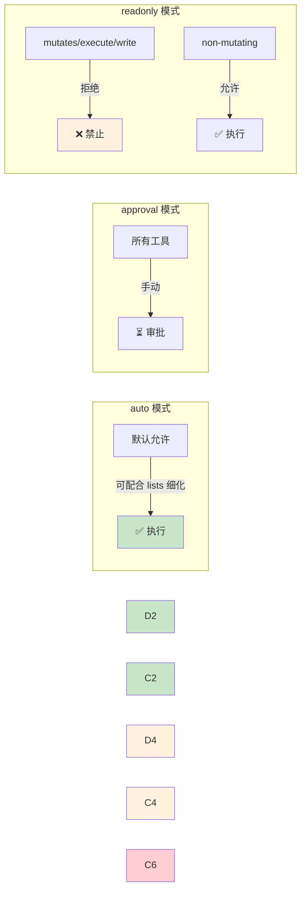
```mermaid
graph LR
    subgraph Auto["auto 模式"]
        A1[默认允许] -->|可配合 lists 细化| A2[✅ 执行]
    end

    subgraph Approval["approval 模式"]
        B1[所有工具] -->|手动| B2[⏳ 审批]
    end

    subgraph Readonly["readonly 模式"]
        R1[mutates/execute/write] -->|拒绝| R2[❌ 禁止]
        R3[non-mutating] -->|允许| R4[✅ 执行]
    end
    
    style D2 fill:#c8e6c9
    style A2 fill:#c8e6c9
    style C2 fill:#c8e6c9
    style D4 fill:#fff3e0
    style R2 fill:#fff3e0
    style C4 fill:#fff3e0
    style C6 fill:#ffcdd2
```

### 权限模式

权限模式（对齐 TS）：
- `Mode="auto"`：默认允许（可配合 `AllowTools/DenyTools/RequireApprovalTools` 细化）
- `Mode="approval"`：所有工具都走审批（`permission_required`）
- `Mode="readonly"`：基于 `ToolDescriptor.metadata` 判断是否会产生副作用；会变更的工具 deny，其余 allow/ask
- `Mode="<custom>"`：宿主进程可注册自定义 permission mode handler（参见 `permission-modes`）

### 配置示例

```csharp
var config = new AgentConfig
{
    Model = "claude-sonnet-4-20250514",
    Tools = ["fs_read", "fs_write", "fs_edit", "bash_run", "fs_rm"],
    Permissions = new PermissionConfig
    {
        Mode = "auto",
        // 允许的工具白名单（可选；设置后不在列表的工具直接 deny）
        AllowTools = ["fs_read", "fs_write", "fs_edit", "bash_run", "fs_rm"],
        // 强制需要审批的工具
        RequireApprovalTools = ["bash_run", "fs_rm"],
        // 完全禁止的工具
        DenyTools = []
    }
};
```

### MCP 工具的权限配置

MCP 工具使用命名空间命名格式：`mcp__{serverName}__{toolName}`

例如：
- `mcp__chrome-devtools__take_screenshot`
- `mcp__filesystem__read_file`
- `mcp__github__create_issue`

由于 MCP 工具名称是动态生成的，推荐使用 `*` 通配符来允许所有工具（包括 MCP 工具）：

```csharp
var permissions = new PermissionConfig
{
    Mode = "auto",
    // 使用 * 通配符允许所有工具（包括 MCP 工具）
    AllowTools = ["*"],  // 或 "*,fs_read,fs_write,..." 确保包含其他工具
    // 对于需要审批的工具，仍然可以明确指定
    RequireApprovalTools = ["bash_run", "fs_rm", "mcp__*__delete_*"],
    // 禁止的工具也可以使用通配符模式
    DenyTools = ["bash_kill"]
};
```

**appsettings.json 配置示例：**
```json
{
  "Kode": {
    "PermissionMode": "auto",
    "AllowTools": "*,fs_read,fs_write,fs_edit,fs_grep,fs_glob,fs_multi_edit",
    "RequireApprovalTools": "bash_run,fs_rm",
    "DenyTools": "bash_kill"
  }
}
```

`*` 通配符匹配任何工具名称，这样可以确保 MCP 工具自动获得执行权限，而无需手动列出每个 `mcp__*__*` 工具。

### 处理审批请求

```csharp
await foreach (var envelope in agent.EventBus.SubscribeAsync(EventChannel.Control))
{
    if (envelope.Event is PermissionRequiredEvent permission)
    {
        Console.WriteLine($"工具 {permission.Call.Name} 请求审批");
        Console.WriteLine($"callId: {permission.Call.Id}");
        Console.WriteLine($"inputPreview: {JsonSerializer.Serialize(permission.Call.InputPreview)}");
        
        // 交互式审批
        Console.Write("是否批准? (y/n): ");
        var input = Console.ReadLine();
        
        if (input?.ToLower() == "y")
        {
            await agent.ApproveToolCallAsync(permission.Call.Id);
        }
        else
        {
            await agent.DenyToolCallAsync(permission.Call.Id, "用户拒绝执行");
        }
    }
}
```

### 工具属性

每个工具可以声明自己的权限属性：

```csharp
public record ToolAttributes
{
    /// <summary>
    /// 工具是否为只读（不修改状态）
    /// </summary>
    public bool ReadOnly { get; init; }

    /// <summary>
    /// 工具是否无副作用
    /// </summary>
    public bool NoEffect { get; init; }

    /// <summary>
    /// 是否需要用户审批
    /// </summary>
    public bool RequiresApproval { get; init; }

    /// <summary>
    /// 是否可以并行执行
    /// </summary>
    public bool AllowParallel { get; init; }

    /// <summary>
    /// 权限分类（用于自定义权限策略）
    /// </summary>
    public string? PermissionCategory { get; init; }
}
```

---

## 状态存储

SDK 提供多种状态存储实现，支持本地开发和分布式部署。

### 存储架构

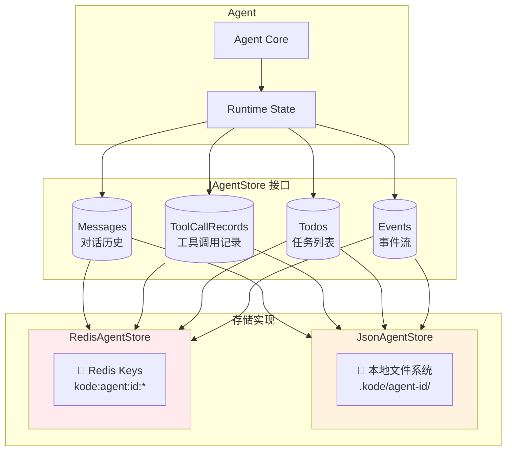
```mermaid
graph TB
    subgraph Agent["Agent"]
        AgentCore[Agent Core]
        State[Runtime State]
    end
    
    subgraph Store["IAgentStore 接口"]
        Messages[(Messages<br/>对话历史)]
        ToolCalls[(ToolCallRecords<br/>工具调用记录)]
        Todos[(Todos<br/>任务列表)]
        Events[(Events<br/>事件流)]
    end
    
    subgraph Implementations["存储实现"]
        subgraph JSON["JsonAgentStore"]
            JFiles[📁 本地文件系统<br/>.kode/agent-id/]
        end
        
        subgraph Redis["RedisAgentStore"]
            RKeys[🔑 Redis Keys<br/>kode:agent:id:*]
        end
    end
    
    AgentCore --> State
    State --> Messages
    State --> ToolCalls
    State --> Todos
    State --> Events
    
    Messages --> JSON
    Messages --> Redis
    ToolCalls --> JSON
    ToolCalls --> Redis
    Todos --> JSON
    Todos --> Redis
    Events --> JSON
    Events --> Redis
    
    style JSON fill:#fff3e0
    style Redis fill:#ffebee
```

### 断点续传流程

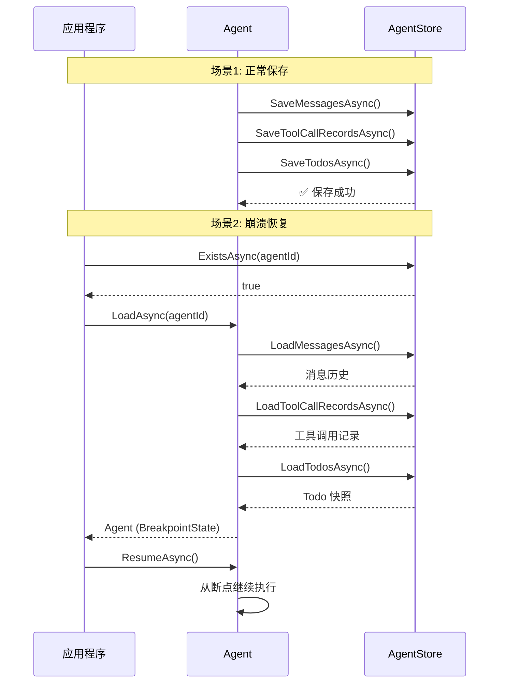
```mermaid
sequenceDiagram
    participant App as 应用程序
    participant Agent
    participant Store as AgentStore
    
    Note over App,Store: 场景1: 正常保存
    Agent->>Store: SaveMessagesAsync()
    Agent->>Store: SaveToolCallRecordsAsync()
    Agent->>Store: SaveTodosAsync()
    Store-->>Agent: ✅ 保存成功
    
    Note over App,Store: 场景2: 崩溃恢复
    App->>Store: ExistsAsync(agentId)
    Store-->>App: true
    App->>Agent: LoadAsync(agentId)
    Agent->>Store: LoadMessagesAsync()
    Store-->>Agent: 消息历史
    Agent->>Store: LoadToolCallRecordsAsync()
    Store-->>Agent: 工具调用记录
    Agent->>Store: LoadTodosAsync()
    Store-->>Agent: Todo 快照
    Agent-->>App: Agent (BreakpointState)
    
    App->>Agent: ResumeAsync()
    Agent->>Agent: 从断点继续执行
```

### JSON 文件存储

适用于本地开发和单机部署：

```csharp
using Kode.Agent.Store.Json;

// 创建存储
var store = new JsonAgentStore("./.kode");

// 或使用依赖注入
services.AddJsonAgentStore(options =>
{
    options.BaseDirectory = "./.kode";
    options.PrettyPrint = true;  // 开发时启用格式化
});
```

存储目录结构：
```
.kode/
├── agent-id-1/
│   ├── messages.json      # 对话历史
│   ├── tool-calls.json    # 工具调用记录
│   ├── todos.json         # Todo 列表
│   └── events/            # 事件日志
└── agent-id-2/
    └── ...
```

### Redis 分布式存储

适用于生产环境和分布式部署：

```csharp
using Kode.Agent.Store.Redis;
using StackExchange.Redis;

// 创建连接
var redis = ConnectionMultiplexer.Connect("localhost:6379");

// 创建存储
var store = new RedisAgentStore(redis, new RedisStoreOptions
{
    KeyPrefix = "kode:agent",
    Database = 0,
    Expiration = TimeSpan.FromDays(7)
});

// 或使用依赖注入
services.AddRedisAgentStore(options =>
{
    options.ConnectionString = Configuration["Redis:ConnectionString"]!;
    options.KeyPrefix = "kode:agent";
    options.Expiration = TimeSpan.FromDays(7);
});
```

### 存储接口

```csharp
public interface IAgentStore
{
    // 消息存储
    Task SaveMessagesAsync(string agentId, IReadOnlyList<Message> messages, CancellationToken ct = default);
    Task<IReadOnlyList<Message>> LoadMessagesAsync(string agentId, CancellationToken ct = default);

    // 工具调用记录
    Task SaveToolCallRecordsAsync(string agentId, IReadOnlyList<ToolCallRecord> records, CancellationToken ct = default);
    Task<IReadOnlyList<ToolCallRecord>> LoadToolCallRecordsAsync(string agentId, CancellationToken ct = default);

    // Todo 存储
    Task SaveTodosAsync(string agentId, TodoSnapshot snapshot, CancellationToken ct = default);
    Task<TodoSnapshot?> LoadTodosAsync(string agentId, CancellationToken ct = default);

    // 事件存储
    Task AppendEventAsync(string agentId, Timeline timeline, CancellationToken ct = default);
    IAsyncEnumerable<Timeline> ReadEventsAsync(
        string agentId,
        EventChannel? channel = null,
        Bookmark? since = null,
        CancellationToken ct = default);

    // 快照（安全分叉点）
    Task SaveSnapshotAsync(string agentId, Snapshot snapshot, CancellationToken ct = default);
    Task<Snapshot?> LoadSnapshotAsync(string agentId, string snapshotId, CancellationToken ct = default);
    Task<IReadOnlyList<Snapshot>> ListSnapshotsAsync(string agentId, CancellationToken ct = default);
    Task DeleteSnapshotAsync(string agentId, string snapshotId, CancellationToken ct = default);

    // Agent 管理
    Task<bool> ExistsAsync(string agentId, CancellationToken ct = default);
    Task DeleteAsync(string agentId, CancellationToken ct = default);
    Task<IReadOnlyList<string>> ListAsync(CancellationToken ct = default);
}
```

### 断点续传

Agent 支持崩溃恢复和断点续传：

```csharp
// 创建或恢复 Agent
Agent agent;
try
{
    agent = await Agent.ResumeFromStoreAsync("my-agent", deps, options: new ResumeOptions
    {
        Strategy = RecoveryStrategy.Crash
    });
    Console.WriteLine($"恢复 Agent，当前断点: {agent.BreakpointState}");
}
catch
{
    agent = await Agent.CreateAsync("my-agent", config, deps);
}

// 如果 Agent 之前在工具执行中崩溃，可以恢复
if (agent.BreakpointState == BreakpointState.ToolExecuting)
{
    Console.WriteLine("检测到未完成的工具执行，正在恢复...");
    await agent.ResumeAsync();
}
```
