# Kode Agent SDK Advanced Guide

> **中文版**: [进阶指南 (中文)](./ADVANCED_GUIDE-zh.md)

This document provides in-depth SDK usage instructions and best practices.

## Table of Contents

1. [Architecture Overview](#architecture-overview)
2. [Agent Lifecycle](#agent-lifecycle)
3. [Event System Details](#event-system-details)
4. [Tool Development Guide](#tool-development-guide)
5. [Skills System](#skills-system)
6. [Sub-Agent Task Delegation](#sub-agent-task-delegation)
7. [Model Providers Deep Dive](#model-providers-deep-dive)
8. [MCP Protocol Integration](#mcp-protocol-integration)
9. [Permission Control System](#permission-control-system)
10. [State Storage](#state-storage)
11. [Error Handling](#error-handling)
12. [Best Practices](#best-practices)

---

## Architecture Overview

### SDK Overall Architecture


---

### Component Dependencies


### Core Components

| Component | Responsibility |
|------|------|
| **Agent** | Conversation state machine, coordinates message processing and tool calls |
| **EventBus** | Event pub/sub center, supports three channels |
| **AgentStore** | State persistence interface (JSON/Redis) |
| **ToolRegistry** | Tool registration and discovery |
| **ModelProvider** | LLM model abstraction layer (Anthropic/OpenAI) |
| **Sandbox** | Secure command execution environment |
| **McpToolProvider** | MCP protocol tool provider |

---

## Agent Lifecycle

### State Transition Diagram


### Breakpoint States (for Crash Recovery)


Agent supports the following runtime states:

| State | Description |
|------|------|
| `Ready` | Agent created, ready to receive input |
| `Working` | Agent is processing messages or executing tools |
| `Paused` | Agent paused, waiting for approval or user input |

| Breakpoint State | Description |
|----------|------|
| `Ready` | Initial state |
| `PreModel` | About to call model |
| `StreamingModel` | Receiving model response |
| `ToolPending` | Tool call pending execution |
| `AwaitingApproval` | Waiting for user approval |
| `PreTool` | About to execute tool |
| `ToolExecuting` | Tool executing |
| `PostTool` | Tool execution complete |

### Creating an Agent

```csharp
// Method 1: Create new Agent
var agent = await Agent.CreateAsync(
    agentId: "unique-id",
    config: new AgentConfig
    {
        Model = "claude-sonnet-4-20250514",
        SystemPrompt = "You are a helpful assistant.",
        MaxIterations = 20,
        Tools = ["fs_read", "shell_exec"]
    },
    dependencies: deps
);

// Method 2: Resume existing Agent (rebuild config from meta.json)
Agent agent2;
try
{
    agent2 = await Agent.ResumeFromStoreAsync("existing-id", deps);
}
catch
{
    agent2 = await Agent.CreateAsync("existing-id", config, deps);
}
```

### Execution Loop

```csharp
// Simple execution
await agent.RunAsync("Hello, please help me analyze this file");

// With cancellation support
using var cts = new CancellationTokenSource(TimeSpan.FromMinutes(5));
await agent.RunAsync("Execute complex task", cts.Token);

// Continuous conversation
await agent.RunAsync("First question");
await agent.RunAsync("Follow-up question");
await agent.RunAsync("Continue discussion");
```

---

## Event System Details

### Three-Channel Architecture


### Event Flow Sequence Diagram


```csharp
[Flags]
public enum EventChannel
{
    Progress = 1, // Real-time progress: text stream, tool execution status
    Control = 2,  // Control flow: approval requests/decisions
    Monitor = 4,  // Observability: state/breakpoint/errors/metrics
    All = Progress | Control | Monitor
}
```

### Event Types

```csharp
// EventEnvelope: { cursor, bookmark, event }
// event body also has channel/type/bookmark:
// event.channel: "progress" | "control" | "monitor"
// event.type: string
// event.bookmark?: Bookmark

// Progress (examples)
// - text_chunk_start: { step }
// - text_chunk: { step, delta }
// - text_chunk_end: { step, text }
// - tool:start / tool:end: { call: ToolCallSnapshot }
// - tool:error: { call: ToolCallSnapshot, error }
// - done: { step, reason: "completed" | "interrupted" }

// Control (examples)
// - permission_required: { call: ToolCallSnapshot } + respond(decision, { note? })
// - permission_decided: { callId, decision: "allow" | "deny", decidedBy, note? }

// Monitor (examples)
// - state_changed: { state }
// - breakpoint_changed: { previous, current, timestamp }
// - error: { severity, phase, message, detail? }
// - token_usage: { inputTokens, outputTokens, totalTokens }
```

### Event Subscription Patterns

```csharp
// Process multiple channels in parallel
var progressTask = Task.Run(async () =>
{
    await foreach (var e in agent.EventBus.SubscribeAsync(EventChannel.Progress))
    {
        // Handle Progress events
    }
});

var controlTask = Task.Run(async () =>
{
    await foreach (var e in agent.EventBus.SubscribeAsync(EventChannel.Control))
    {
        // Handle Control events
    }
});

// Run Agent
await agent.RunAsync("Start task");

// Wait for event processing to complete
await Task.WhenAll(progressTask, controlTask);
```

---

## Tool Development Guide

### Tool Execution Flow

```mermaid
flowchart TD
    A[Agent receives tool call] --> B{Tool exists?}
    B -->|No| C[Return error to LLM]
    B -->|Yes| D{Check permissions}

    D --> E{PermissionConfig}
    E -->|In denyTools or not in allowTools| I[Deny execution]
    E -->|In requireApprovalTools| G[Request approval]
    E -->|Otherwise| J{mode}

    J -->|auto| F[Allow execution]
    J -->|approval| G
    J -->|readonly| K{descriptor.metadata.mutates/access}
    K -->|mutates/execute/write| I
    K -->|non-mutating| F

    G --> L[Publish permission_required（control）]
    L --> M{User response}
    M -->|Approve| F
    M -->|Deny| I

    F --> N[Create ToolContext]
    N --> O[Execute tool]
    O --> P{Success?}
    P -->|Yes| Q[Return ToolResult.Ok]
    P -->|No| R[Return ToolResult.Error]

    I --> S[Return denial message to LLM]

    Q --> T[Continue Agent loop]
    R --> T
    S --> T

    style F fill:#c8e6c9
    style G fill:#fff3e0
    style I fill:#ffcdd2
```



### Tool Interface

```csharp
public interface ITool
{
    string Name { get; }
    string Description { get; }
    JsonElement InputSchema { get; }

    Task<ToolResult> ExecuteAsync(
        JsonElement input,
        ToolContext context,
        CancellationToken cancellationToken = default
    );
}
```

### Using Source Generator

Source Generator generates tool schema and validation code at compile time, avoiding runtime reflection.

```csharp
using Kode.Agent.Sdk.Tools;

[Tool("database_query")]
[Description("Execute SQL query on the database")]
[Category("database")]
public partial class DatabaseQueryTool : ITool
{
    [ToolParameter("query", required: true)]
    [Description("SQL query to execute")]
    public string Query { get; set; } = "";

    [ToolParameter("database")]
    [Description("Database name, defaults to 'main'")]
    public string Database { get; set; } = "main";

    [ToolParameter("timeout")]
    [Description("Query timeout in seconds")]
    public int Timeout { get; set; } = 30;

    public async Task<ToolResult> ExecuteAsync(ToolContext context)
    {
        try
        {
            using var connection = new SqlConnection(GetConnectionString(Database));
            using var command = new SqlCommand(Query, connection)
            {
                CommandTimeout = Timeout
            };

            await connection.OpenAsync(context.CancellationToken);
            using var reader = await command.ExecuteReaderAsync(context.CancellationToken);

            var results = await ReadResultsAsync(reader);
            return ToolResult.Success(JsonSerializer.Serialize(results));
        }
        catch (Exception ex)
        {
            return ToolResult.Error($"Query failed: {ex.Message}");
        }
    }
}
```

Generated code after compilation:

```csharp
// Auto-generated - do not edit manually
public partial class DatabaseQueryTool
{
    public string Name => "database_query";
    public string Description => "Execute SQL query on the database";

    public JsonElement InputSchema => JsonDocument.Parse("""
    {
        "type": "object",
        "properties": {
            "query": {
                "type": "string",
                "description": "SQL query to execute"
            },
            "database": {
                "type": "string",
                "description": "Database name, defaults to 'main'"
            },
            "timeout": {
                "type": "integer",
                "description": "Query timeout in seconds"
            }
        },
        "required": ["query"]
    }
    """).RootElement;
}
```

### Tool Registration

```csharp
// Single tool
toolRegistry.Register<DatabaseQueryTool>();

// Batch registration
toolRegistry.RegisterFromAssembly(typeof(DatabaseQueryTool).Assembly);

// Dynamic registration
toolRegistry.Register(new ToolDefinition
{
    Name = "custom_tool",
    Description = "A dynamically registered tool",
    InputSchema = schema
}, ExecuteCustomTool);
```

### Tool Context

```csharp
public record ToolContext(
    string AgentId,
    ISandbox Sandbox,
    ILogger Logger,
    CancellationToken CancellationToken
);
```

---

## Skills System

Skills is a progressive disclosure mechanism that allows Agents to discover and activate additional capabilities on demand, rather than loading everything into context at startup.

### Skills Architecture


### Skills Lifecycle


### SKILL.md Format

```markdown
---
name: code-review
description: Code review skill, helps identify code issues and improvement suggestions
license: Apache-2.0
compatibility: claude-3.5-sonnet, gpt-4o
allowedTools:
  - fs_read
  - fs_grep
  - fs_glob
---

# Code Review Guide

## Review Focus
1. Code style and consistency
2. Potential bugs and edge cases
3. Performance optimization opportunities
4. Security vulnerability checks

## Output Format
Please use the following format for review results:
- 🔴 Critical issues
- 🟡 Suggested improvements
- 🟢 Good practices
```

### Skill Directory Structure

```
skills/
├── code-review/
│   ├── SKILL.md           # Skill definition (required)
│   └── resources/
│       ├── scripts/       # Executable scripts
│       ├── references/    # Reference documentation
│       └── assets/        # Resource files
├── testing/
│   ├── SKILL.md
│   └── resources/
└── documentation/
    └── SKILL.md
```

### Configuring Skills

```csharp
var skillsConfig = new SkillsConfig
{
    // Skill search paths
    Paths = ["./.kode/skills", "./skills"],

    // Whitelist: only load these skills
    Include = ["code-review", "testing"],

    // Blacklist: exclude these skills
    Exclude = ["deprecated-skill"],

    // Trusted sources: allow script execution
    Trusted = ["code-review"],

    // Validate format on load
    ValidateOnLoad = true
};

// Create skills manager
var skillsManager = new SkillsManager(skillsConfig, sandbox, store, agentId);

// Discover skills (lightweight, metadata only)
var skills = await skillsManager.DiscoverAsync();

// Activate skill (on-demand full content load)
var skill = await skillsManager.ActivateAsync("code-review");
```

### Skill Tools

| Tool | Description |
|------|------|
| `skill_list` | List available skills and their activation status |
| `skill_activate` | Activate specified skill |
| `skill_resource` | Read skill resource files |

```csharp
// Agent can autonomously manage skills through tools
// skill_list - View available skills
// skill_activate - Activate needed skills
// skill_resource - Read skill resources
```

---

## Sub-Agent Task Delegation

Sub-Agent mechanism allows main Agent to delegate complex tasks to specialized sub-agents, enabling division of labor and workflow orchestration.

### Sub-Agent Architecture


### Task Delegation Flow


### Defining Agent Templates

```csharp
var templates = new List<AgentTemplate>
{
    new AgentTemplate
    {
        Id = "code-analyst",
        System = "You are a professional code analyst. Focus on code quality, architecture, and potential issues.",
        Tools = ["fs_read", "fs_grep", "fs_glob"],
        WhenToUse = "Analyze code structure, identify issues, provide improvement suggestions"
    },
    new AgentTemplate
    {
        Id = "test-writer",
        System = "You are a test engineer. Focus on writing comprehensive unit tests and integration tests.",
        Tools = ["fs_read", "fs_write", "bash_run"],
        WhenToUse = "Write test cases, improve code coverage"
    },
    new AgentTemplate
    {
        Id = "doc-generator",
        System = "You are a technical documentation expert. Focus on generating clear, accurate documentation.",
        Tools = ["fs_read", "fs_write"],
        WhenToUse = "Generate API docs, README, usage guides"
    }
};

// Create task_run tool
var taskRunTool = TaskRunToolFactory.Create(templates);
toolRegistry.Register(taskRunTool);
```

### Using task_run Tool

Agent delegates tasks through `task_run` tool:

```json
{
  "tool": "task_run",
  "arguments": {
    "agent_template_id": "code-analyst",
    "description": "Analyze user authentication module",
    "prompt": "Please analyze the code under src/auth/ directory, identify security vulnerabilities and improvement opportunities",
    "context": "This is a Node.js application using JWT"
  }
}
```

### Sub-Agent Configuration

```csharp
// Configure Sub-Agent behavior in template
var runtimeConfig = new TemplateRuntimeConfig
{
    SubAgents = new SubAgentConfig
    {
        // Allowed templates
        Templates = ["code-analyst", "test-writer"],

        // Maximum nesting depth (prevent infinite recursion)
        Depth = 2,

        // Inherit parent config
        InheritConfig = true,

        // Override config
        Overrides = new SubAgentOverrides
        {
            Permission = new PermissionConfig
            {
                Mode = "approval"
            }
        }
    }
};
```

### Sub-Agent vs Skills

| Feature | Skills | Sub-Agent |
|------|--------|-----------|
| **Purpose** | Extend single Agent capabilities | Delegate tasks to specialized Agents |
| **Execution** | In same Agent context | Independent Agent instances |
| **State** | Shared Agent state | Isolated state |
| **Use Cases** | Add domain-specific knowledge | Complex multi-step task breakdown |
| **Overhead** | Lightweight | Heavier (new Agent instances) |

---

## Model Providers Deep Dive

### Custom Provider

```csharp
public class CustomProvider : IModelProvider
{
    public string Name => "custom";

    public async IAsyncEnumerable<StreamingContent> StreamAsync(
        IReadOnlyList<Message> messages,
        ModelOptions options,
        IReadOnlyList<ToolDefinition> tools,
        [EnumeratorCancellation] CancellationToken cancellationToken = default)
    {
        // 1. Build request
        var request = BuildRequest(messages, options, tools);

        // 2. Send request and get stream
        var stream = await SendStreamingRequest(request, cancellationToken);

        // 3. Parse and yield content
        await foreach (var chunk in ParseStream(stream, cancellationToken))
        {
            if (chunk.IsText)
            {
                yield return new TextContent(chunk.Text);
            }
            else if (chunk.IsToolCall)
            {
                yield return new ToolCallContent(
                    chunk.ToolId,
                    chunk.ToolName,
                    chunk.Arguments
                );
            }
        }
    }
}
```

### Provider Options

```csharp
// Anthropic options
public class AnthropicOptions
{
    public string ApiKey { get; set; } = "";
    public string? BaseUrl { get; set; }
    public string? ModelId { get; set; }
    public int MaxTokens { get; set; } = 8192;
    public bool EnableBetaFeatures { get; set; } = false;
    public Dictionary<string, string> CustomHeaders { get; set; } = new();
}

// OpenAI options
public class OpenAIOptions
{
    public string ApiKey { get; set; } = "";
    public string? BaseUrl { get; set; }
    public string? Organization { get; set; }
    public string DefaultModel { get; set; } = "gpt-4o";
    public int MaxTokens { get; set; } = 4096;
}
```

---

## Error Handling

### Exception Types

```csharp
// Base exception
public class KodeAgentException : Exception { }

// Provider error
public class ProviderException : KodeAgentException
{
    public string ProviderName { get; }
    public int? StatusCode { get; }
}

// Tool execution error
public class ToolExecutionException : KodeAgentException
{
    public string ToolName { get; }
    public JsonElement Input { get; }
}

// Configuration error
public class ConfigurationException : KodeAgentException { }
```

### Error Handling Patterns

```csharp
try
{
    await agent.RunAsync("Execute task");
}
catch (ProviderException ex) when (ex.StatusCode == 429)
{
    // Rate limit, wait and retry
    await Task.Delay(TimeSpan.FromSeconds(60));
    await agent.RunAsync("Execute task");
}
catch (ProviderException ex) when (ex.StatusCode == 401)
{
    // Invalid API key
    throw new ConfigurationException("Invalid API key", ex);
}
catch (ToolExecutionException ex)
{
    // Tool execution failed
    logger.LogError(ex, "Tool {Tool} failed", ex.ToolName);
    // Agent will automatically report error to LLM
}
catch (OperationCanceledException)
{
    // Task cancelled
    // Runtime continuously persists messages/tool-calls/todos/meta/events;
    // To preserve a "forkable safe branch point", use Snapshot.
    await agent.SnapshotAsync();
}
```

### Handling Errors Through Events

```csharp
await foreach (var envelope in agent.EventBus.SubscribeAsync(EventChannel.Progress))
{
    if (envelope.Event is ErrorEvent error)
    {
        logger.LogError(error.Exception, "Agent error occurred");

        if (error.Exception is ProviderException pe && pe.StatusCode == 429)
        {
            // Notify user of rate limit
            Console.WriteLine("Too many requests, please try again later");
        }
    }
}
```

---

## Best Practices

### 1. Use Serilog Structured Logging

Recommended to use Serilog for structured logging:

```csharp
using Serilog;
using Serilog.Events;

// Configure Serilog (before creating WebApplication)
Log.Logger = new LoggerConfiguration()
    .MinimumLevel.Information()
    .MinimumLevel.Override("Microsoft", LogEventLevel.Warning)
    .MinimumLevel.Override("Microsoft.AspNetCore", LogEventLevel.Warning)
    .Enrich.FromLogContext()
    .WriteTo.Console(
        outputTemplate: "[{Timestamp:HH:mm:ss} {Level:u3}] {SourceContext}{NewLine}{Message:lj}{NewLine}{Exception}")
    .WriteTo.File(
        "logs/kode-.log",
        rollingInterval: RollingInterval.Day,
        outputTemplate: "{Timestamp:yyyy-MM-dd HH:mm:ss.fff zzz} [{Level:u3}] {Message:lj}{NewLine}{Exception}",
        retainedFileCountLimit: 7)
    .CreateLogger();

try
{
    Log.Information("Starting Kode.Agent WebApi Assistant");

    var builder = WebApplication.CreateBuilder(args);
    builder.Host.UseSerilog();  // Use Serilog

    // ... service configuration ...

    var app = builder.Build();
    Log.Information("Application started successfully");
    app.Run();
}
catch (Exception ex)
{
    Log.Fatal(ex, "Application terminated unexpectedly");
}
finally
{
    Log.CloseAndFlush();
}
```

**For non-WebAPI applications:**
```csharp
// Use dependency injection
var services = new ServiceCollection();
services.AddSingleton<ILoggerFactory>(sp =>
{
    var loggerFactory = LoggerFactory.Create(builder =>
    {
        builder.AddSerilog();  // Integrate Serilog
    });
    return loggerFactory;
});

var deps = new AgentDependencies
{
    LoggerFactory = services.BuildServiceProvider().GetRequiredService<ILoggerFactory>(),
    // ...
};
```

### 2. Set Reasonable Timeouts

```csharp
// Agent level
var config = new AgentConfig
{
    MaxIterations = 20,           // Limit iterations
    IterationTimeout = TimeSpan.FromMinutes(2),  // Per-iteration timeout
    TotalTimeout = TimeSpan.FromMinutes(30)      // Total timeout
};

// Tool level
using var cts = CancellationTokenSource.CreateLinkedTokenSource(
    context.CancellationToken
);
cts.CancelAfter(TimeSpan.FromSeconds(30));

await ExecuteLongOperation(cts.Token);
```

### 3. Implement Graceful Shutdown

```csharp
var cts = new CancellationTokenSource();
Console.CancelKeyPress += (s, e) =>
{
    e.Cancel = true;
    cts.Cancel();
};

try
{
    await agent.RunAsync("Long running task", cts.Token);
}
catch (OperationCanceledException)
{
    Console.WriteLine("Saving state...");
    await agent.SnapshotAsync();
    Console.WriteLine("Exited safely");
}
```

### 4. Resource Management

```csharp
// Use using to ensure cleanup
await using var agent = await Agent.CreateAsync(id, config, deps);
await agent.RunAsync("Task");

// Or manual management
var agent = await Agent.CreateAsync(id, config, deps);
try
{
    await agent.RunAsync("Task");
}
finally
{
    await agent.DisposeAsync();
}
```

### 5. Tool Permission Control

```csharp
// Create restricted tool set
var safeTools = new[] { "fs_read", "fs_glob" };  // Read-only operations

var config = new AgentConfig
{
    Tools = safeTools,
    // ...
};

// Or use tool wrapper for permission checks
toolRegistry.Register(
    new PermissionWrapper(
        innerTool: new ShellExecTool(),
        allowedCommands: ["ls", "cat", "grep"]
    )
);
```

### 6. Session Management

```csharp
// Manage multiple Agents based on session ID
public class SessionManager
{
    private readonly ConcurrentDictionary<string, Agent> _sessions = new();

    public async Task<Agent> GetOrCreateAsync(string sessionId)
    {
        return await _sessions.GetOrAddAsync(sessionId, async id =>
        {
            try
            {
                return await Agent.ResumeFromStoreAsync(id, _deps);
            }
            catch
            {
                return await Agent.CreateAsync(id, _config, _deps);
            }
        });
    }

    public async Task EndSessionAsync(string sessionId)
    {
        if (_sessions.TryRemove(sessionId, out var agent))
        {
            await agent.DisposeAsync();
        }
    }
}
```

---

## Common Questions

### Q: How to handle large files?

```csharp
// Use streaming read
var tool = new StreamingFileReader();
await foreach (var chunk in tool.ReadChunksAsync(filePath))
{
    // Process chunks
}
```

### Q: How to limit Token usage?

```csharp
var config = new AgentConfig
{
    MaxTokensPerIteration = 4096,
    MaxTotalTokens = 50000
};
```

### Q: How to switch models?

```csharp
// Can switch at runtime
agent.Config.Model = "claude-3-5-haiku-20241022";

// Or use different configs for different tasks
var fastConfig = config with { Model = "claude-3-5-haiku-20241022" };
var smartConfig = config with { Model = "claude-sonnet-4-20250514" };
```

---

## Example Projects

See `examples/` directory for more examples:

- **GettingStarted** - Basic usage
- **AgentInbox** - Multi-Agent collaboration
- **ApprovalControl** - Manual approval process
- **RoomCollab** - Real-time collaboration scenarios
- **CustomToolsExample** - Custom tool development
- **HooksUsage** - Lifecycle hooks
- **TemplateUsage** - Agent template system
- **SchedulerUsage** - Scheduled task management
- **EventBusUsage** - Event bus details

```bash
cd examples/Kode.Agent.Examples
dotnet run
```

---

## MCP Protocol Integration

SDK has native support for [Model Context Protocol (MCP)](https://modelcontextprotocol.io/), making it easy to integrate external tool ecosystems.

### MCP Architecture Diagram


### MCP Communication Flow


### What is MCP?

MCP is an open protocol that allows AI models to interact with external tools and data sources in a standardized way. Through MCP, you can:

- Connect to thousands of existing MCP servers
- Unify tool management from different sources
- No adapter code needed

### Configuring MCP Servers

```csharp
using Kode.Agent.Mcp;

// Stdio transport (subprocess)
var stdioConfig = new McpConfig
{
    Transport = McpTransportType.Stdio,
    Command = "npx",
    Args = ["-y", "@modelcontextprotocol/server-filesystem", "/workspace"],
    ServerName = "filesystem",
    Environment = new Dictionary<string, string>
    {
        ["NODE_ENV"] = "production"
    }
};

// HTTP/SSE transport
var httpConfig = new McpConfig
{
    Transport = McpTransportType.Http,
    Url = "http://localhost:3000/mcp",
    Headers = new Dictionary<string, string>
    {
        ["Authorization"] = "Bearer your-token"
    },
    ServerName = "remote-server"
};
```

### Loading MCP Servers from appsettings.json

In WebAPI applications, you can use `McpServersLoader` to load MCP servers from configuration:

**appsettings.json:**
```json
{
  "Kode": {
    "AllowTools": "*,fs_read,fs_write,fs_edit,fs_grep,fs_glob,fs_multi_edit"
  },
  "McpServers": {
    "chrome-devtools": {
      "command": "npx",
      "args": ["-y", "chrome-devtools-mcp@latest"]
    },
    "filesystem": {
      "command": "npx",
      "args": ["-y", "@modelcontextprotocol/server-filesystem", "/workspace"],
      "env": {
        "NODE_ENV": "production"
      }
    },
    "remote-server": {
      "transport": "http",
      "url": "https://api.example.com/mcp",
      "headers": {
        "Authorization": "Bearer your-token"
      }
    }
  }
}
```

**Program.cs:**
```csharp
// Register MCP services
builder.Services.AddMcpClientManager();
builder.Services.AddSingleton<McpServersLoader>();

var app = builder.Build();

// Load MCP tools on startup
var mcpLoader = app.Services.GetRequiredService<McpServersLoader>();
var toolRegistry = app.Services.GetRequiredService<IToolRegistry>();
var mcpToolCount = await mcpLoader.LoadAndRegisterServersAsync(
    builder.Configuration,
    toolRegistry,
    CancellationToken.None);

Log.Information("[MCP] Loaded {Count} tools from MCP servers", mcpToolCount);
```

### Tool Filtering

```csharp
var config = new McpConfig
{
    Transport = McpTransportType.Stdio,
    Command = "npx",
    Args = ["-y", "@modelcontextprotocol/server-github"],
    // Only include specific tools
    Include = ["create_issue", "list_issues", "get_issue"],
    // Or exclude specific tools
    Exclude = ["delete_repository"]
};
```

### Using in Dependency Injection

```csharp
services.AddMcpToolProvider(options =>
{
    options.Configs = new[]
    {
        new McpConfig
        {
            Transport = McpTransportType.Stdio,
            Command = "npx",
            Args = ["-y", "@modelcontextprotocol/server-filesystem", "/tmp"],
            ServerName = "filesystem"
        },
        new McpConfig
        {
            Transport = McpTransportType.Stdio,
            Command = "npx",
            Args = ["-y", "@modelcontextprotocol/server-github"],
            ServerName = "github",
            Environment = new Dictionary<string, string>
            {
                ["GITHUB_TOKEN"] = Configuration["GitHub:Token"]!
            }
        }
    };
});
```

### Common MCP Servers

| Server | Description | Install Command |
|--------|------|----------|
| filesystem | File system operations | `npx @modelcontextprotocol/server-filesystem` |
| github | GitHub API | `npx @modelcontextprotocol/server-github` |
| postgres | PostgreSQL database | `npx @modelcontextprotocol/server-postgres` |
| memory | Knowledge graph storage | `npx @modelcontextprotocol/server-memory` |
| brave-search | Web search | `npx @anthropic-ai/mcp-server-brave-search` |

---

## Permission Control System

SDK provides flexible and fine-grained permission control mechanism to ensure Agent operates within secure boundaries.

### Permission Decision Flow


### Permission Mode Comparison

```mermaid
graph LR
    subgraph Auto["auto mode"]
        A1[Default allow] -->|Can refine with lists| A2[✅ Execute]
    end

    subgraph Approval["approval mode"]
        B1[All tools] -->|Manual| B2[⏳ Approval]
    end

    subgraph Readonly["readonly mode"]
        R1[mutates/execute/write] -->|Deny| R2[❌ Block]
        R3[non-mutating] -->|Allow| R4[✅ Execute]
    end

    style A2 fill:#c8e6c9
    style B2 fill:#fff3e0
    style R2 fill:#ffcdd2
    style R4 fill:#c8e6c9
```



### Permission Modes

Permission modes:
- `Mode="auto"`：Default allow (can be refined with `AllowTools/DenyTools/RequireApprovalTools`)
- `Mode="approval"`：All tools require approval (`permission_required`)
- `Mode="readonly"`：Based on `ToolDescriptor.metadata` to determine if it produces side effects; tools that mutate get denied, others allow/ask
- `Mode="<custom>"`：Host process can register custom permission mode handler

### Configuration Example

```csharp
var config = new AgentConfig
{
    Model = "claude-sonnet-4-20250514",
    Tools = ["fs_read", "fs_write", "fs_edit", "bash_run", "fs_rm"],
    Permissions = new PermissionConfig
    {
        Mode = "auto",
        // Tool whitelist (optional; if set, tools not in list are denied)
        AllowTools = ["fs_read", "fs_write", "fs_edit", "bash_run", "fs_rm"],
        // Tools that require approval
        RequireApprovalTools = ["bash_run", "fs_rm"],
        // Completely forbidden tools
        DenyTools = []
    }
};
```

### MCP Tool Permission Configuration

MCP tools use namespaced naming format: `mcp__{serverName}__{toolName}`

Examples:
- `mcp__chrome-devtools__take_screenshot`
- `mcp__filesystem__read_file`
- `mcp__github__create_issue`

Since MCP tool names are dynamically generated, it's recommended to use the `*` wildcard to allow all tools (including MCP tools):

```csharp
var permissions = new PermissionConfig
{
    Mode = "auto",
    // Use * wildcard to allow all tools (including MCP tools)
    AllowTools = ["*"],  // Or "*,fs_read,fs_write,..." to ensure other tools are included
    // For tools requiring approval, can still specify explicitly
    RequireApprovalTools = ["bash_run", "fs_rm", "mcp__*__delete_*"],
    // Forbidden tools can also use wildcard patterns
    DenyTools = ["bash_kill"]
};
```

**appsettings.json configuration example:**
```json
{
  "Kode": {
    "PermissionMode": "auto",
    "AllowTools": "*,fs_read,fs_write,fs_edit,fs_grep,fs_glob,fs_multi_edit",
    "RequireApprovalTools": "bash_run,fs_rm",
    "DenyTools": "bash_kill"
  }
}
```

The `*` wildcard matches any tool name, ensuring MCP tools automatically get execution permission without manually listing each `mcp__*__*` tool.

### Handling Approval Requests

```csharp
await foreach (var envelope in agent.EventBus.SubscribeAsync(EventChannel.Control))
{
    if (envelope.Event is PermissionRequiredEvent permission)
    {
        Console.WriteLine($"Tool {permission.Call.Name} requests approval");
        Console.WriteLine($"callId: {permission.Call.Id}");
        Console.WriteLine($"inputPreview: {JsonSerializer.Serialize(permission.Call.InputPreview)}");

        // Interactive approval
        Console.Write("Approve? (y/n): ");
        var input = Console.ReadLine();

        if (input?.ToLower() == "y")
        {
            await agent.ApproveToolCallAsync(permission.Call.Id);
        }
        else
        {
            await agent.DenyToolCallAsync(permission.Call.Id, "User denied execution");
        }
    }
}
```

### Tool Attributes

Each tool can declare its own permission attributes:

```csharp
public record ToolAttributes
{
    /// <summary>
    /// Whether the tool is read-only (doesn't modify state)
    /// </summary>
    public bool ReadOnly { get; init; }

    /// <summary>
    /// Whether the tool has no side effects
    /// </summary>
    public bool NoEffect { get; init; }

    /// <summary>
    /// Whether user approval is required
    /// </summary>
    public bool RequiresApproval { get; init; }

    /// <summary>
    /// Whether the tool can be executed in parallel
    /// </summary>
    public bool AllowParallel { get; init; }

    /// <summary>
    /// Permission category (for custom permission policies)
    /// </summary>
    public string? PermissionCategory { get; init; }
}
```

---

## State Storage

SDK provides multiple state storage implementations supporting local development and distributed deployment.

### Storage Architecture

```mermaid
graph TB
    subgraph Agent["Agent"]
        AgentCore[Agent Core]
        State[Runtime State]
    end

    subgraph Store["IAgentStore Interface"]
        Messages[(Messages<br/>Conversation history)]
        ToolCalls[(ToolCallRecords<br/>Tool call records)]
        Todos[(Todos<br/>Task list)]
        Events[(Events<br/>Event stream)]
    end

    subgraph Implementations["Storage Implementations"]
        subgraph JSON["JsonAgentStore"]
            JFiles[📁 Local filesystem<br/>.kode/agent-id/]
        end

        subgraph Redis["RedisAgentStore"]
            RKeys[🔑 Redis Keys<br/>kode:agent:id:*]
        end
    end

    AgentCore --> State
    State --> Messages
    State --> ToolCalls
    State --> Todos
    State --> Events

    Messages --> JSON
    Messages --> Redis
    ToolCalls --> JSON
    ToolCalls --> Redis
    Todos --> JSON
    Todos --> Redis
    Events --> JSON
    Events --> Redis

    style JSON fill:#fff3e0
    style Redis fill:#ffebee
```



### Checkpoint Recovery Flow

```mermaid
sequenceDiagram
    participant App as Application
    participant Agent
    participant Store as AgentStore

    Note over App,Store: Scenario 1: Normal save
    Agent->>Store: SaveMessagesAsync()
    Agent->>Store: SaveToolCallRecordsAsync()
    Agent->>Store: SaveTodosAsync()
    Store-->>Agent: ✅ Save successful

    Note over App,Store: Scenario 2: Crash recovery
    App->>Store: ExistsAsync(agentId)
    Store-->>App: true
    App->>Agent: LoadAsync(agentId)
    Agent->>Store: LoadMessagesAsync()
    Store-->>Agent: Message history
    Agent->>Store: LoadToolCallRecordsAsync()
    Store-->>Agent: Tool call records
    Agent->>Store: LoadTodosAsync()
    Store-->>Agent: Todo snapshot
    Agent-->>App: Agent (BreakpointState)

    App->>Agent: ResumeAsync()
    Agent->>Agent: Continue from breakpoint
```



### JSON File Storage

Suitable for local development and single machine deployment:

```csharp
using Kode.Agent.Store.Json;

// Create storage
var store = new JsonAgentStore("./.kode");

// Or use dependency injection
services.AddJsonAgentStore(options =>
{
    options.BaseDirectory = "./.kode";
    options.PrettyPrint = true;  // Enable formatting for development
});
```

Storage directory structure:
```
.kode/
├── agent-id-1/
│   ├── messages.json      # Conversation history
│   ├── tool-calls.json    # Tool call records
│   ├── todos.json         # Todo list
│   └── events/            # Event logs
└── agent-id-2/
    └── ...
```

### Redis Distributed Storage

Suitable for production environments and distributed deployment:

```csharp
using Kode.Agent.Store.Redis;
using StackExchange.Redis;

// Create connection
var redis = ConnectionMultiplexer.Connect("localhost:6379");

// Create storage
var store = new RedisAgentStore(redis, new RedisStoreOptions
{
    KeyPrefix = "kode:agent",
    Database = 0,
    Expiration = TimeSpan.FromDays(7)
});

// Or use dependency injection
services.AddRedisAgentStore(options =>
{
    options.ConnectionString = Configuration["Redis:ConnectionString"]!;
    options.KeyPrefix = "kode:agent";
    options.Expiration = TimeSpan.FromDays(7);
});
```

### Storage Interface

```csharp
public interface IAgentStore
{
    // Message storage
    Task SaveMessagesAsync(string agentId, IReadOnlyList<Message> messages, CancellationToken ct = default);
    Task<IReadOnlyList<Message>> LoadMessagesAsync(string agentId, CancellationToken ct = default);

    // Tool call records
    Task SaveToolCallRecordsAsync(string agentId, IReadOnlyList<ToolCallRecord> records, CancellationToken ct = default);
    Task<IReadOnlyList<ToolCallRecord>> LoadToolCallRecordsAsync(string agentId, CancellationToken ct = default);

    // Todo storage
    Task SaveTodosAsync(string agentId, TodoSnapshot snapshot, CancellationToken ct = default);
    Task<TodoSnapshot?> LoadTodosAsync(string agentId, CancellationToken ct = default);

    // Event storage
    Task AppendEventAsync(string agentId, Timeline timeline, CancellationToken ct = default);
    IAsyncEnumerable<Timeline> ReadEventsAsync(
        string agentId,
        EventChannel? channel = null,
        Bookmark? since = null,
        CancellationToken ct = default);

    // Snapshots (safe fork points)
    Task SaveSnapshotAsync(string agentId, Snapshot snapshot, CancellationToken ct = default);
    Task<Snapshot?> LoadSnapshotAsync(string agentId, string snapshotId, CancellationToken ct = default);
    Task<IReadOnlyList<Snapshot>> ListSnapshotsAsync(string agentId, CancellationToken ct = default);
    Task DeleteSnapshotAsync(string agentId, string snapshotId, CancellationToken ct = default);

    // Agent management
    Task<bool> ExistsAsync(string agentId, CancellationToken ct = default);
    Task DeleteAsync(string agentId, CancellationToken ct = default);
    Task<IReadOnlyList<string>> ListAsync(CancellationToken ct = default);
}
```

### Checkpoint Recovery

Agent supports crash recovery and checkpoint resumption:

```csharp
// Create or resume Agent
Agent agent;
try
{
    agent = await Agent.ResumeFromStoreAsync("my-agent", deps, options: new ResumeOptions
    {
        Strategy = RecoveryStrategy.Crash
    });
    Console.WriteLine($"Resumed Agent, current breakpoint: {agent.BreakpointState}");
}
catch
{
    agent = await Agent.CreateAsync("my-agent", config, deps);
}

// If Agent crashed during tool execution, can recover
if (agent.BreakpointState == BreakpointState.ToolExecuting)
{
    Console.WriteLine("Detected incomplete tool execution, recovering...");
    await agent.ResumeAsync();
}
```
